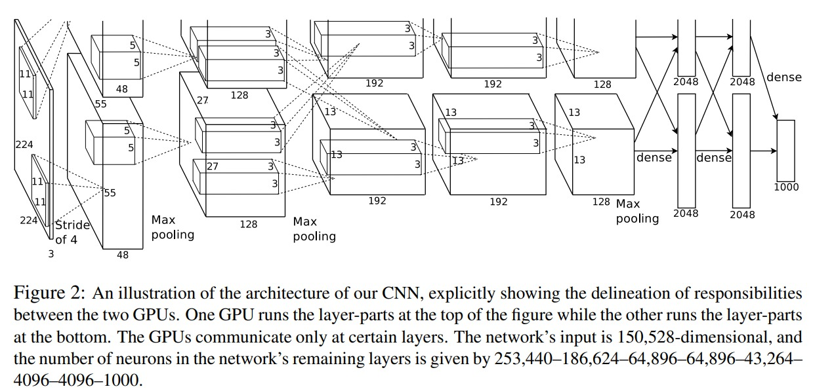

# AlexNet

## AlexNet Architecture (2012) by Alex Krizhevsky Ilya Sutskever Geoffrey E. Hinton.

As this architecture is trained on a ImageNet dataset with around 1.2 million training examples. So In original paper, the authors have used 2 GPUs to train the model. 

- Current GPUs are particularly well-suited to cross-GPU parallelization, as they are able to read from and write to one another’s memory directly, without going through host machine memory. They put half of the kernels (or neurons) on one each GPU. But here GPU communicate with each other only in certain layers.

- This means that, for example, the kernels of layer 3 take input from all kernel maps in layer 2. However, kernels in layer 4 take input only from those kernel maps in layer 3 which reside on the same GPU.

`ReLU` as an aactivation function is used in this architecture. ReLUs have the desirable property that they do not require input normalization to prevent them from saturating. If at least some training examples produce a positive input to a ReLU, learning will happen in that neuron. 

`Local Response Normalization` is used to normalize the output of the convolutional layers. This is done to reduce the overfitting of the model. This is done by normalizing the output of each neuron by the mean of the outputs of the neurons in the local neighborhood. 

$$ b^i_{x,y} = a^i_{x,y} / (k + \alpha \sum_{j=max(0, i-n/2)}^{min(N-1, i+n/2)} (a_{x,y}^j)^2)^{\beta} $$

where $a^i_{x,y}$ is the output of the $i^{th}$ neuron at position $(x,y)$, $b^i_{x,y}$ is the normalized output of the $i^{th}$ neuron at position $(x,y)$, $N$ is the total number of neurons in the layer, $n$ is the local neighborhood size, $k$ is a small constant, $\alpha$ is a scaling parameter, and $\beta$ is an exponent parameter.

here k=2, n=5, $\alpha = 10^{-4}$ and $\beta = 0.75$. This Normalization was applied after applying Relu activation.

`Overlapping Pooling` for kernel size (z x z) and stride (s x s), if we set z = s we will get traditional local Pooling which is commonly used. But in Overlapping Pooling we set z < s. Here we have s=2 and z=3.

# Overall Architecture

## Data Augmentation

- We employ two distinct forms of data augmentation, both of which allow transformed images to be produced from the original images with very little computation, so the transformed images do not need to be stored on disk. In our implementation, the transformed images are generated in Python code on the CPU while the GPU is training on the previous batch of images. So these data augmentation schemes are, in effect, computationally free.

- The first form of data augmentation consists of generating image translations and horizontal reflections. We do this by extracting random 224 × 224 patches (and their horizontal reflections) from the
256×256 images and training our network on these extracted patches. This is a very efficient form of data augmentation, as it requires no additional computation beyond the random cropping and flipping operations.

- The second form of data augmentation consists of altering the intensities of the RGB channels in training images. Specifically, we perform PCA on the set of RGB pixel values throughout the ImageNet training set.

## Dropout

`Dropout` is used to reduce overfitting. Dropout is a regularization technique where randomly selected neurons are ignored during training. This forces the network to share information between the neurons.

## Learning Rate

- We trained our models using stochastic gradient descent with a batch size of 128 examples, momentum of 0.9, and weight decay of 0.0005.

$$ w_{i+1} = 0.9 v_{i} - 0.0005 * \epsilon * w_{i} - \epsilon * \frac{\partial L}{\partial w_{i}} * w_{i+1} = w_i + v_{i+1} $$

We used an equal learning rate for all layers, which we adjusted manually throughout training. The heuristic which we followed was to divide the learning rate by 10 when the validation error rate stopped improving with the current learning rate. The learning rate was initialized at 0.01 and reduced three times prior to termination. 

## Initialization

We initialize the weights using a zero-mean Gaussian with standard deviation 0.01. We initialized the neuron biases in the second, fourth, and fifth convolutional layers, as well as in the fully-connected hidden layers, with the constant 1. Remaining Layers were initialized with zero.

## Final Implementation (Simplified)

- Here I haven't used different initializer for different layers. I have initialized all the weigths with glorot_initializer and biases with constant 0.

- I also haven't used the concept of wwigth decay.

| Layer | Input Size | Output Size | Kernel Size | Stride | Padding | Activation |
| --- | --- | --- | --- | --- | --- | --- 
| Input | - | 224x224x3 | - | - | - | - 
| Conv1 | 224x224x3 | 54x54x96 | 11x11 | 4 | valid | ReLU |
| LRN1 | 54x54x96 | 54x54x96 | - | - | - | - |
| MaxPool1 | 54x54x96 | 26x26x96 | 3x3 | 2 | - | - |
| Conv2 | 26x26x96 | 26x26x256 | 5x5 | 1 | same | ReLU |
| LRN2 | 26x26x256 | 26x26x256 | - | - | - | - |
| MaxPool2 | 26x26x256 | 12x12x256 | 3x3  | 2 | -| - |
| Conv3 | 12x12x256 | 12x12x384 | 3x3 | 1 | same | ReLU |
| Conv4 | 12x12x384 | 12x12x384 | 3x3 | 1 | same | ReLU |
| Conv5 | 12x12x384 | 12x12x256 | 3x3 | 1 | same | ReLU |
| MaxPool3 | 12x12x256 | 5x5x256 | 3x3  | 2 | -| - |
| FC1 | 5x5x256 | 6400 | - | - | - | - |
| FC2 | 6400 | 4096 | - | - | - | ReLU |
| Dropout1 (0.5) | 4096 | 4096 | - | - | - | - |
| FC3 | 4096 | 4096 | - | - | - | ReLU |
| Dropout2 (0.5) | 4096 | 4096 | - | - | - | - |
| FC4 | 4096 | 1000 | - | - | - | - |

Total Parameters: 46,787,978