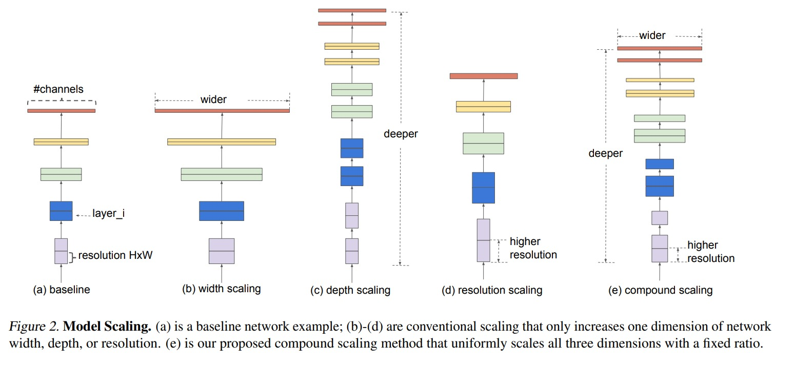
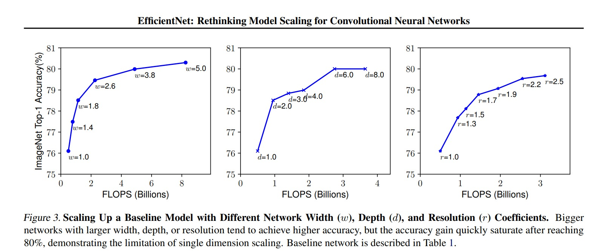
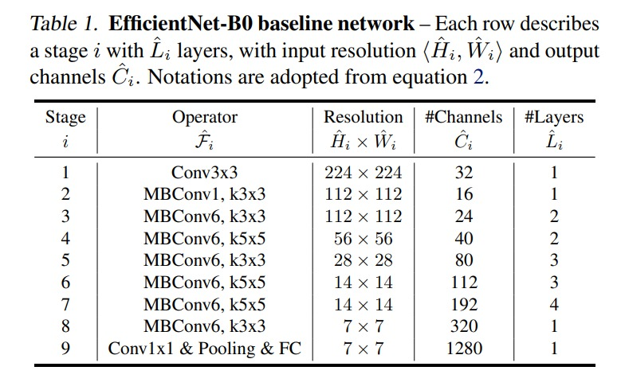
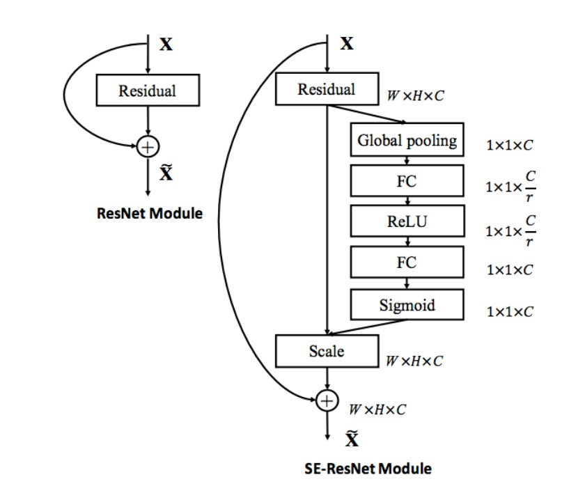
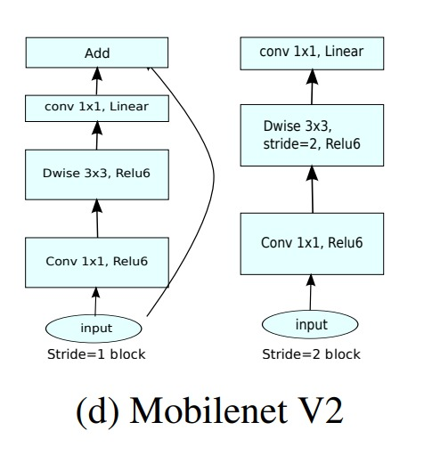

# EfficientNet

## EfficientNet: Rethinking Model Scaling for Convolutional Neural Networks by Mingxing Tan, Quoc V. Le

# Motivation

We know that to achieve a better accuracy we scale up the `ConvNet` model. So auhtor suggest that we should scale up the `ConvNet` model in a more structured way. They proposed a new scaling method that uniformly scales all dimensions of depth/width/resolution using a simple yet highly effective compound coefficient. They also found that it's critical to use a simple and effective `compound scaling method` to scale up `ConvNets` in order to achieve better accuracy.

## Depth Scaling

Depth scaling means how many layers we should use in our `ConvNet` model. We can scale up the depth of the network by adding `more layers`.

## Width Scaling

Width scaling means how many channels we should use in our `ConvNet` model. We can scale up the width of the network by adding more channels. But if we add `more channels`.

## Resolution Scaling

Resolution scaling means increase the input `image size`.

# Scaling Dimensions

## 1. Depth (d)

Scaling network depth is the most common way used by many ConvNets.  The intuition is that `deeper ConvNet` can `capture richer and more complex features`, and `generalize well` on new tasks. However, deeper networks are also more difficult to train due to the `vanishing gradient problem`.

- Although several techniques such as `skip connections` and `batch normalization`, alleviate the training problem, the accuracy gain of very deep network diminishes: for example, ResNet-1000 has similar accuracy as ResNet-101 even though it has much more layers.

## 2. Width (w)

Scaling network width is commonly used for `small size models`. Wider Networks are able to capture more fine-grained feautres, and are easire to train. However extremely wide but shallow networks tend to have difficulties in capturing higher level features.

## 3. Resolution (r)

With higher resolution input images, ConvNets can potentially capture more fine-grained pattern. Higher resolutions improve accuracy, but the accuracy gain diminishes for very high resolutions.

# COmpound Scaling

Author introduced a new `compound scaling method` which uses a `compound coefficient` $\phi$ to uniformly scaless network width, depth and resolution in a principled way:

$$d = \alpha^\phi$$

$$w = \beta^\phi$$

$$r = \gamma^\phi$$

where $\alpha$, $\beta$, $\gamma$ are constants derived from a small baseline network. $\phi$ is a user-specified coefficient that controls how many more resources are available for model scaling.

such that $\alpha \times \beta^2 \times \gamma^2 \approx 2$.

and $\alpha \geq 1$, $\beta \geq 1$, $\gamma \geq 1$.

# Architecture

Here `MBConv` is a `Mobile Inverted Bottleneck Convolution` block. It's a `lightweight` and `efficient` `ConvNet` block that is used in `MobileNetV2` and `MnasNet`. It's a `depthwise separable convolution` block with `squeeze and excitation` block.

## Squeeze and Excitation

- The `squeeze` operation computes the `channel descriptor` by simply applying `global average pooling` to the input feature map. The `excitation` operation computes the `channel-wise excitation weights` by passing the `channel descriptor` through a `small fully-connected` network. The `reweighting` operation computes the output feature map by multiplying the input feature map with the `channel-wise excitation weights`. It gives `weights to each channel` instead of treating them equally.

## MobileNetV2

- `MobileNetV2` uses `depthwise separable convolution` block with `squeeze and excitation` block. It uses `bottleneck` architecture to reduce the number of parameters. It uses `swish` activation function.