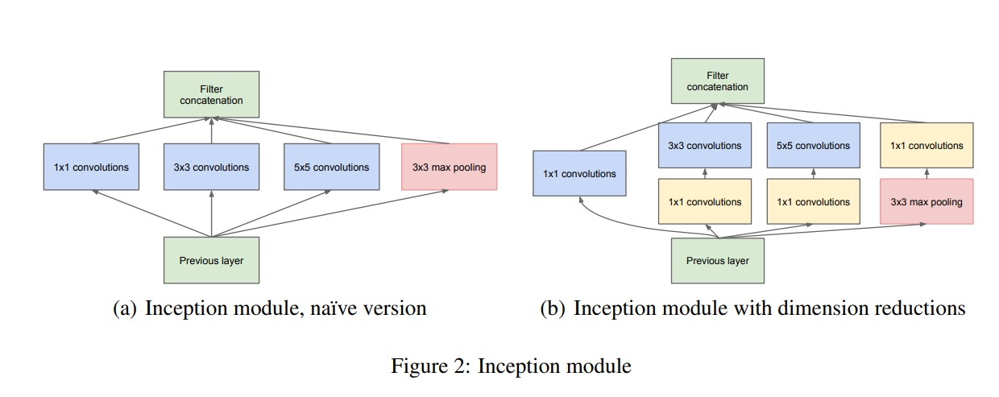
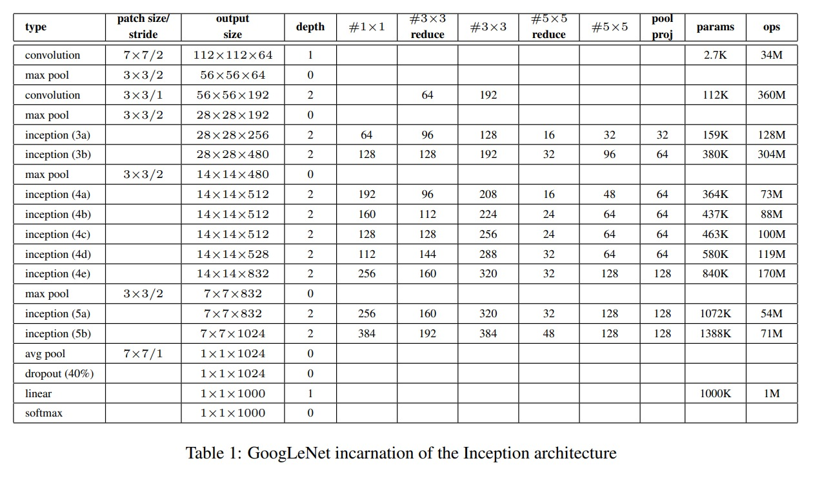

# Inception

## Inception by Christian Szegedy, Vincent Vanhoucke, Wei Liu, Yangqing Jia, Pierre Sermanet, Scott Reed, Dragomir Anguelov, Dumitru Erhan, Vincent Vanhoucke, Andrew Rabinovich 

# Motivation

Inception was designed in such a way so that we can have a network that is very deep and wide while keeping the computational cost low. The idea is to use a **1 × 1 convolution** to reduce the number of channels before the **3 × 3 convolution**. This reduces the number of parameters and computations in the network.

## Drawback of Bigger Networks

- Bigger size typically means a larger number of parameters, which makes the enlarged network more prone to `overfitting`, especially if the number of labeled examples in the training set is limited.

- Dramatically increased use of computational resources.

The fundamental way of solving both issues would be by ultimately moving from fully connected to sparsely connected architectures, even inside the convolutions.

# Architectural Detail

## GoogLeNet

- The network consists of 9 inception modules stacked on top of each other, with occasional max-pooling layers with stride 2 to halve the resolution of the grid.

- The last part of the network is a global average pooling layer, a 40% dropout, and a softmax layer.

- An average pooling layer with 5×5 filter size and stride 3, resulting in an 4×4×512 output for the (4a), and 4×4×528 for the (4d) stage.

- A 1×1 convolution with 128 filters for dimension reduction and rectified linear activation. 

- A fully connected layer with 1024 units and rectified linear activation.

- A dropout layer with 70% ratio of dropped outputs.

- A linear layer with softmax loss as the classifier (predicting the same 1000 classes as the main classifier, but removed at inference time).
