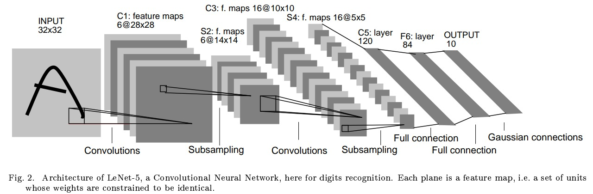
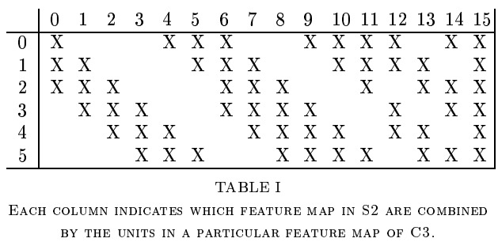

# LeNet

## LeNet-5 Architecture (1998) by Yann LeCun

This is the original LeNet-5 architecture. 

It is a simple convolutional neural network with 7 layers. 

- **Input**: 32x32 grayscale image (1 channel) (32x32x1). Images were of different sizes from (28x28) to (20x20) so they were centered in a 32x32 image. It is normalized in such a way that the background level is -0.1 and the foreground level is 1.175. This makes the mean input nearly zero and the variance nearly 1 which accelerates the learning process.
- **Layer 1 (C1)**: Convolutional layer with 6 filters of size 5x5 and stride 1 and valid padding. Each unit in each feature map is connected to a 5x5 neighbourhood in the input. The output is `28x28x6`. (156 trainable parameters and 122,304 connections)
- **Layer 2 (S2)**: Average pooling (Subsampling) layer with 6 filters of size 2x2 and stride 2 and valid padding. Note that the four inputs are added and then multiplied by a trainable coefficents and then are added to a trainable bias. The final result is passed through a sigmoid. This is called subsampling. The output is `14x14x6`. (12 trainable parameters and 5,880 connections)
- **Layer 3 (C3)**: Convolutional layer with 16 filters of size 5x5 and stride 1 and valid padding. The output is `10x10x16`. (1,516 trainable parameters and 151,600 connections)

    

    Here First 6 C3 feature maps taks inputs from every contiguous subsets of 3 feature maps in S2. The next 6 take input from every contiguous subset of 4. The next 6 take input from some discontinuous subset of 4. Finally the last one takes input from all S2 feature maps. This type of connection was done to break the symmetry in the network. This is called **spatial pooling** as well as to reduce the number of parameters

- **Layer 4 (S4)**: Average pooling (Subsampling) layer with 16 filters of size 2x2 and stride 2 and valid padding. Each unit in each feature map is connected to a 2x2 neighbourhood in the corresponding feature map in C3. The output is `5x5x16`. (32 trainable parameters and 2,000 connections)
- **Layer 5 (C5)**: Convolutional layer with 120 filters of size 5x5 and stride 1 and valid padding. Each unit is connected to a 5x5 neighbourhood on all 16 of S4's feature maps. The output is `1x1x120`. (48,120 trainable parameters)
- **Layer 6 (F6)**: Fully connected layer with 84 neurons. The output is `1x1x84`. (10,164 trainable parameters)

    Activation function upto Layer 6 is Scaled $tanh$ i.e. 1.7159* $tanh(Sx)$ . 

- **Layer 7 (F7)**: Fully connected layer with 10 neurons. The output is `1x1x10` and activation function is softmax. (850 trainable parameters and 84 connections)

The output layer is composed of Euclidean Radial Basis Function units (RBF), one for each class, with 84 input each. The output of each RBF unit $y_i$ is computed as:

$$y_i =  \sum_{j=1}^{84} \left( x_j - w_{ij} \right)^2 $$

where $x_j$ is the output of the $j^{th}$ neuron in the previous layer, $w_{ij}$ is the weight of the $j^{th}$ neuron in the $i^{th}$ RBF unit. The output of the network is the class with the highest output value. In other words, each output RBF unit computes the Euclidean distance between its input vector and its weight vector. The further away is the input vector from the weight vector, the larger is the RBF output.

| Layer | # filters/neurons | filter size | stride | padding | activation | output size | # trainable parameters |
|-------|-------------------|-------------|--------|---------|------------|-------------|------------------------|
| Input | -                 | -       | -      | -   |            | 32x32x1     |                        |
| C1    | 6                 | 5x5     | 1      | valid | 1.7159*tanh       | 28x28x6     | 156                    |
| S2    | 6                 | 2x2     | 2      | valid | sigmoid    | 14x14x6     | 12                     |
| C3    | 16                | 5x5     | 1      | valid | 1.7159*tanh       | 10x10x16    | 1,516                  |
| S4    | 16                | 2x2     | 2      | valid | sigmoid    | 5x5x16      | 32                     |
| C5    | 120               | 5x5     | 1      | valid | 1.7159*tanh       | 1x1x120     | 48,120                 |
| F6    | 84                | -       | -      | -     | 1.7159*tanh       | 1x1x84      | 10,164                 |
| F7    | 10                | -       | -      | -     | softmax    | 1x1x10      | 850                    |

Total Parameters: 60,850

---

## LeNet-5 (Modified-1) 

In this we will not multiply the output of the Pooling layer with a trainable coefficient and add a trainable bias. In this we will use the fully connected Conv layers instead of subsampling layers. Using relu activation function instead of tanh. 

## LeNet-5 (Modified-2)

In this we will use Max Pooling instead of Average Pooling. and input image will be of size 28x28x1. and will use padding as same in the first layer which is same as using valid padding with (32x32x1) input image.