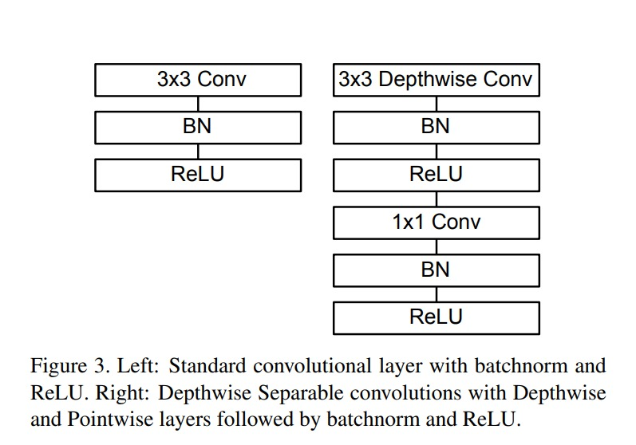
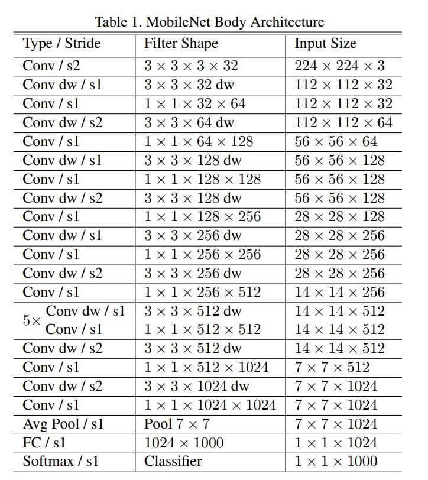

# MobileNets

## MobileNets: Efficient Convolutional Neural Networks for Mobile Vision Applications by Andrew G. Howard, Menglong Zhu, Bo Chen, Dmitry Kalenichenko, Weijun Wang, Tobias Weyand, Marco Andreetto, Hartwig Adam

# Motivation

This paper is about `Efficient Convolutional Neural Networks for Mobile Vision Applications`. The authors propose a novel architecture called `MobileNets` for mobile and embedded vision applications. The authors also demonstrate the effectiveness of MobileNets across a wide range of applications and use cases including object detection, finegrain classification, face attributes and large scale geo-localization.

The standard convolution operation has the effect of `filtering features` based on the convolutional kernels and `combining features` in order to produce a new representation.

The authors propose a new convolutional layer, the `depthwise separable convolutional layer` which factorizes the standard convolutional layer into a depthwise convolutional layer and a pointwise convolutional layer. 

- The `depthwise convolutional` layer performs `filtering` of input channels with a `different kernel` for each input channel producing `n` output channels. The `pointwise convolutional` layer then performs a 1x1 convolution, essentially a linear projection, of the output channels of the depthwise convolutional layer to produce the final output channels. The pointwise convolutional layer is used to `combine features` from the previous layer.

# Architecture

## Width Multiplier: Thinner Models

The authors propose a hyperparameter called the `width multiplier` which is used to construct thinner models. For a given layer and width multiplier `α`, the number of input channels to the layer is `αM` and the number of output channels is `αN`. The number of parameters in each layer is `α^2MN`. Here `α` is in the range `(0, 1]`.

## Resolution Multiplier: Reduced Representation

The authors also propose a hyperparameter called the `resolution multiplier` which is used to construct smaller models. For a given layer and resolution multiplier `ρ`, the input image is resized to `ρH x ρW` and the number of filters in each layer is `ρ^2M`. Here `ρ` is in the range `(0, 1]`.