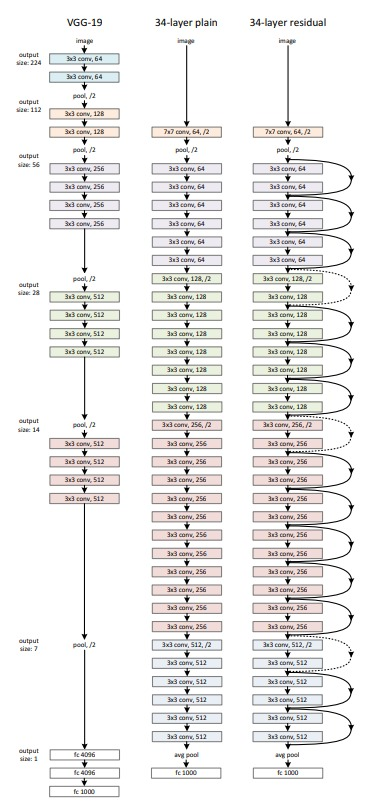
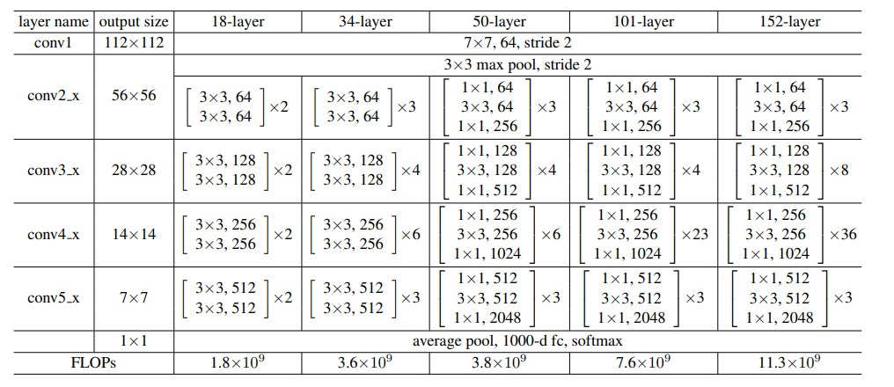
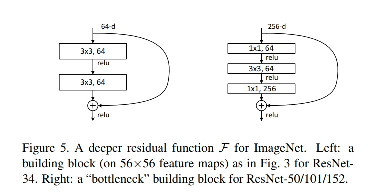

# ResNet

## Residual Network (ResNet) by Kaiming He, Xiangyu Zhang, Shaoqing Ren, Jian Sun

# Motivation

## Is learning better networks as easy as stacking more layers?

- An obstacle to answering this question was the notorious problem of vanishing/exploding gradients , which hamper convergence from the beginning. This problem, however, has been largely addressed by **normalized initialization and intermediate normalization layers** , which enable networks with tens of layers to start converging for stochastic gradient descent (SGD) with backpropagation .

- **When deeper networks are able to start converging, a degradation problem has been exposed**: with the network depth increasing, accuracy gets saturated (which might be unsurprising) and then degrades rapidly. Unexpectedly, such degradation (of training accuracy) is not caused by overfitting, and adding more layers to a suitably deep model leads to higher training error.

## Solution: Identity Mappings in Deep Residual Networks

- There exists a solution by construction to the deeper model: the **added layers are identity mapping**, and the other layers are copied from the learned shallower model. The existence of this constructed solution indicates that a deeper model should produce no higher training error than its shallower counterpart.

Instead of hoping each few stacked layers directly fit a desired underlying mapping, we explicitly let these layers fit a residual mapping. Formally, denoting the desired underlying mapping as H(x), we let the stacked nonlinear layers fit another mapping of $F(x) := H(x)−x$. The original mapping is recast into $F(x)+x$. The residual mapping is easier to optimize, as it has a lower depth and can be optimized end-to-end with backpropagation. The residual mapping also has a natural interpretation as a **shortcut connection** that skips a few layers.

## Residual Learning

Let us consider H(x) as an underlying mapping to be fit by a few stacked layers (not necessarily the entire net), with x denoting the inputs to the first of these layers. If one hypothesizes that multiple nonlinear layers can asymptotically approximate complicated functions , then it is equivalent to hypothesize that they can asymptotically approximate the residual functions, i.e.,  $(x) − x$ (assuming that the input and output are of the same dimensions). So rather than expect stacked layers to approximate  (x), we explicitly let these layers approximate a residual function $F(x) := H(x) − x$. The original function thus becomes $F(x)+x$. Although both forms should be able to asymptotically approximate the desired functions (as hypothesized), the ease of learning might be different.

- The degradation problem suggests that the solvers might have difficulties in approximating identity mappings by multiple nonlinear layers. With the residual learning reformulation, if identity mappings are optimal, **the solvers may simply drive the weights of the multiple nonlinear layers toward zero** to approach identity mappings.

## Identity Mapping by Shortcuts

$$ y = F(x, \{W_i\}) + x $$

- If F and x have the same dimension, then the identity mapping is achieved. If F and x have different dimensions, then the identity mapping is achieved by a linear projection of x to the dimension of F. This is a common practice in deep learning, e.g., in the fully-connected layers of a neural network.

$$ y = F(x, \{W_i\}) + W_s x $$

- The form of the residual function F is flexible. Experiments in this paper involve a function F that has two or three layers, while more layers are possible. But if F has only a single layer, Eqn.(1) is similar to a linear layer: $y = W1x + x$, for which we have not observed advantages.

## Network Architecture

- The convolutional layers mostly have 3×3 filters and follow two simple design rules: (i) for the same output feature map size, the layers have the same number of filters; and (ii) if the feature map size is halved, the number of filters is doubled so as to preserve the time complexity per layer. We perform downsampling directly by convolutional layers that have a stride of 2. The network ends with a global average pooling layer and a 1000-way fully-connected layer with softmax. The total number of weighted layers is 34.

- **Residual Network**. Based on the above plain network, we insert shortcut connections (Fig, right) which turn the network into its counterpart residual version. The identity shortcuts can be directly used when the input and output are of the same dimensions (solid line shortcuts in Fig). When the dimensions increase (dotted line shortcuts in Fig), we consider two options: (A) The shortcut still performs identity mapping, with extra zero entries padded for increasing dimensions. This option introduces no extra parameter; (B) The projection shortcut in Eqn.(2) is used to match dimensions (done by 1×1 convolutions). For both options, when the shortcuts go across feature maps of two sizes, they are performed with a stride of 2.

## Identity vs. Projection Shortcuts:

- We have shown that parameter-free, identity shortcuts help with training.

- For Projection shortcuts, We have:
    - **ResNet-A:** **zero-padding shortcuts** are used for increasing dimensions, and all shortcuts are parameter free.
    - **ResNet-B:** **projection shortcuts** are used for increasing dimensions, and other shortcuts are identity.
    - **ResNet-C:** all shortcuts are projections.

## Deeper Bottleneck Architectures:

For each residual function F, we use a stack of 3 layers instead of 2 (Fig. Left). The three layers are 1×1, 3×3, and 1×1 convolutions, where the 1×1 layers are responsible for reducing and then increasing (restoring) dimensions, leaving the 3×3 layer a bottleneck with smaller input/output dimensions.

- The **parameter-free identity shortcuts** are particularly important for the bottleneck architectures. If the identity shortcut in Fig (right) is replaced with projection, one can show that the **time complexity and model size are doubled**, as the shortcut is connected to the two high-dimensional ends. So identity shortcuts lead to more efficient models for the bottleneck designs.

## Implementation Details

Here are some details of the model which we are going implement.

### Plain Network

- In the plain network, we will use 3 × 3 convolutions and 2 × 2 max-pooling.

### Residual Networks A (ResNet-A)

- In this we will use **zero-padding shortcuts** to increase dimensions, and all shortcuts are parameter free.

**Note:** For the model with layers more than 34 uses bottleneck architecture and it uses the second option for increasing dimensions so, by definition, it is not ResNetA.

### Residual Networks B (ResNet-B)

- In this we will use **projection shortcuts** to increase dimensions, and other shortcuts are identity.

## Preprocessing Details

The image is resized with its shorter side randomly sampled in [256, 480] for scale augmentation . A 224×224 crop is randomly sampled from an image or its horizontal flip, with the per-pixel mean subtracted . The standard color augmentation is used. We adopt batch normalization (BN) right after each convolution and before activation.

We use SGD with a mini-batch size of 256. The learning rate starts from 0.1 and is divided by 10 when the error plateaus, and the models are trained for up to 60 × 104 iterations. We use a weight decay of 0.0001 and a momentum of 0.9.