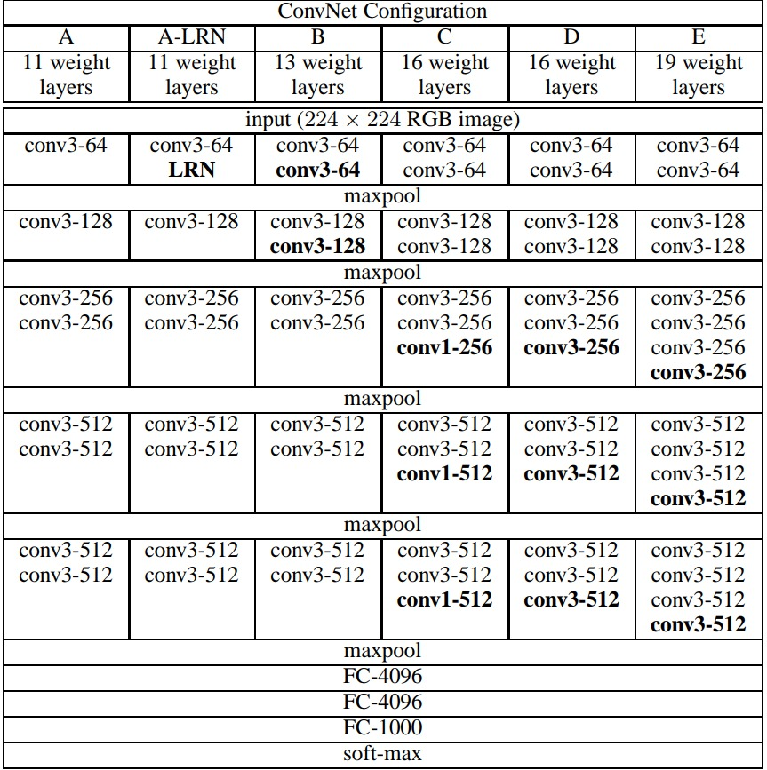

# VGG

## Visual Geometry Group (VGG) by Karen Simonyan and Andrew Zisserman (2014)

- The depth of the configurations increases from the left (A) to the right (E), as more layers are added (the added layers are shown in bold). The convolutional layer parameters are denoted as “convhreceptive field sizei-hnumber of channelsi”. The ReLU activation function is not shown for brevity.

## ConvNet COnfigurations

Input to ConvNets is a fixed-size 224 × 224 RGB image. The only preprocessing done is subtracting the mean RGB value, computed on the training set, from each pixel. The image is passed through a stack of convolutional (conv.) layers, where we use filters with a very small receptive field: 3 × 3 (which is the smallest size to capture the notion of left/right, up/down, center). In one of the configurations we also utilise 1 × 1 convolution filters, which can be seen as a linear transformation of the input channels (followed by non-linearity). The convolution stride is fixed to 1 pixel; the spatial padding of conv. 

Layer input is such that the spatial resolution is preserved after convolution, i.e. the padding is 1 pixel for 3 × 3 conv. layers. Spatial pooling is carried out by five max-pooling layers, which follow some of the conv. layers (not all the conv. layers are followed by max-pooling). Max-pooling is performed over a 2 × 2 pixel window, with stride 2.

## Fully-Connected Layers

A stack of convolutional layers (which has a different depth in different architectures) is followed by three Fully-Connected (FC) layers: the first two have 4096 channels each, the third performs 1000-way ILSVRC classification and thus contains 1000 channels (one for each class). The final layer is the soft-max layer. The configuration of the fully connected layers is the same in all networks.

- All the hidden layers are equipped with the rectified linear unit (ReLU) non-linearity. The fully-connected layers at the end of the ConvNets are equipped with the softmax non-linearity.

### Local Response Normalization (LRN) (Not Implemented)

Here none of the network (except for one) contain Local Response Normalization (LRN) layers. As such normalization does not improve the performance on the ILSVRC dataset, but leads to increased memory consumption and computation time. Where applicable, the parameters for the LRN layer are those of (Krizhevsky et al., 2012).

## DISCUSSION

Rather than using relatively large receptive fileds in the first conv layers (e.g. 11 × 11 with stride 4 in (Krizehevsky et al., 2012)), we use very small 3 × 3 receptive fields through out the whole net, which are convolved with the input at every pixel (with stride 1). 

- It is easy to see that a stack of two 3×3 conv. layers (without spatial pooling in between) has an effective receptive field of 5×5; three such layers have a 7 × 7 effective receptive field.

The incorporation of 1 × 1 conv. layers is a way to increase the non-linearity of the decision function without affecting the receptive fields of the conv layers 

- Even though in our case the 1 × 1 convolution is essentially a linear projection onto the space of the same dimensionality (the number of input and output channels is the same), an additional non-linearity is introduced by the rectification function. It should be noted that 1×1 conv. layers have recently been utilised in the “Network in Network” architecture of Lin et al. (2014).

## TRAINING

The training is carried out by optimising the multinomial logistic regression objective using mini-batch gradient descent (based on back-propagation (LeCun et al., 1989)) with momentum. The batch size was set to 256, momentum to 0.9. The training was regularised by weight decay (the L2 penalty multiplier set to 5 · 10−4 ) and dropout regularisation for the first two fully-connected layers (dropout ratio set to 0.5). The learning rate was initially set to 10−2 , and then decreased by a factor of 10 when the validation set accuracy stopped improving. In total, the learning rate was decreased 3 times, and the learning was stopped after 370K iterations (74 epochs).

The initialisation of the network weights is important, since bad initialisation can stall learning due to the instability of gradient in deep nets. To circumvent this problem, we began with training the configuration A, shallow enough to be trained with random initialisation. Then, when training deeper architectures, we initialised the first four convolutional layers and the last three fully-connected layers with the layers of net A (the intermediate layers were initialised randomly). We did not decrease the learning rate for the pre-initialised layers, allowing them to change during learning. For random initialisation (where applicable), we sampled the weights from a normal distribution with the zero mean and 10−2 variance. The biases were initialised with zero. 

- To obtain the fixed-size 224×224 ConvNet input images, they were randomly cropped from rescaled training images (one crop per image per SGD iteration). To further augment the training set, the crops underwent random horizontal flipping and random RGB colour shift (Krizhevsky et al., 2012).

## Training image size

While training the author used two approaches to obtain the fixed-size 224 × 224 ConvNet input images. The first one was single-scale training and second one was multi-scale training.

## TESTING

Since the fully-convolutional network is applied over the whole image, there is no need to sample multiple crops at test time.

The fully-connected layers are first converted to convolutional layers (the first FC layer to a 7 × 7 conv. layer, the last two FC layers to 1 × 1 conv. layers). The resulting fully-convolutional net is then applied to the whole (uncropped) image. The result is a class score map with the number of channels equal to the number of classes, and a variable spatial resolution, dependent on the input image size. Finally, to obtain a fixed-size vector of class scores for the image, the class score map is spatially averaged (sum-pooled). We also augment the test set by horizontal flipping of the images; the soft-max class.