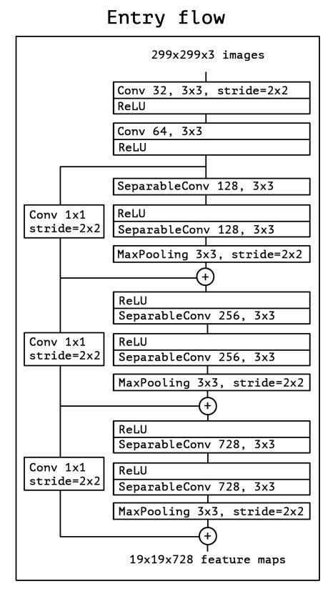
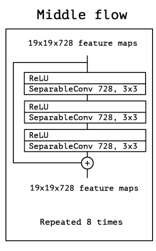
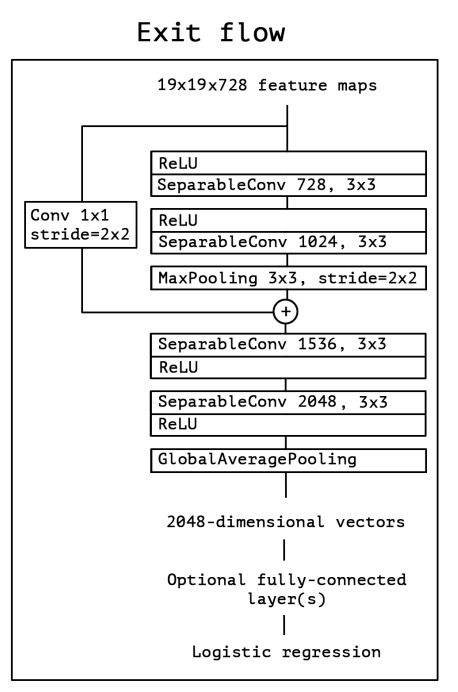

# Xception

## Xception: Deep Learning with Depthwise Separable Convolutions by François Chollet (Google)

# Motivation

- Inception module is a good idea, but it is not efficient enough because it still uses regular convolution.

In `normal CNN`, if we use 3x3x3 filter (kernel_size = (3,3) and 3 features map). Let total number of filters we use is 32.

- Then we need 3x3x3x32 = 864 parameters for this layer.

In `Separable Convolution`, we use 2 layers: `Depthwise Convolution` and `Pointwise Convolution`. We first use 3x3x1x3 filter (kernel_size = (3,3,1) and 3 feature map) for Depthwise Convolution. Then we use 1x1x3x32 filter (kernel_size = (1,1,3) and 32 feature map) for Pointwise Convolution.

- Then we need 3x3x1x3 + 1x1x3x32 = 123 parameters for this layer.

As we see above, that is a huge difference. So, we can reduce the number of parameters by using `Separable Convolution`.

## Inception Hypotesis

- The fundamental hypothesis behind Inception is that `cross-channel correlations` and `spatial correlations` are `sufficiently decoupled` that it is preferable not to map them jointly.

## Xception Hypotesis

- In this we assume that `cross-channel correlations` and `spatial correlations` are `completely decoupled`.

# Architecture

- This consists of 3 parts: Entry Flow, Middle Flow and Exit Flow.

## Entry Flow

## Middle Flow

## Exit Flow

