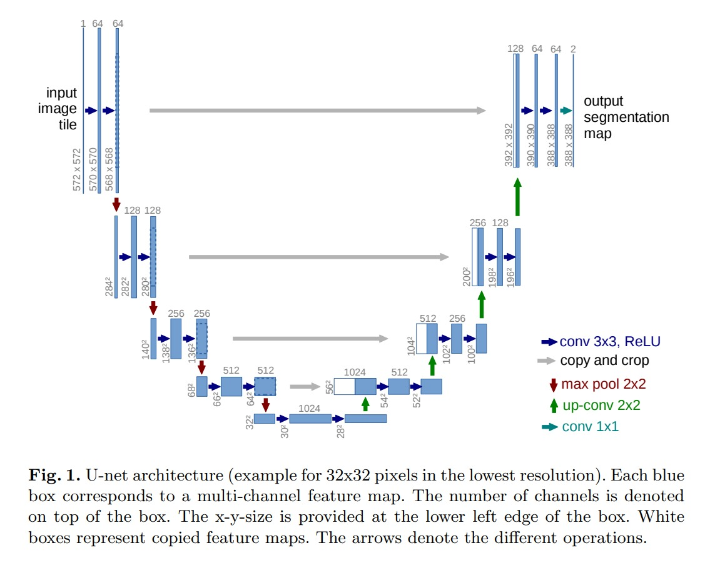

# U-Net (Image Segmentation)

## U-Net: : Convolutional Networks for Biomedical Image Segmentation by Olaf Ronneberger, Philipp Fischer, Thomas Brox

# Motivation

While convolutional networks have already existed for a long time, their success was limited due to the size of the available training sets and the size of the considered networks.

- The typical use of convolutional networks is on classification tasks, where the output to an image is a single class label. However, in many visual tasks, especially in biomedical image processing, the desired output should include localization, i.e., a class label is supposed to be assigned to each pixel.

## Fully Convolutional Networks

- The first step towards fully convolutional networks was the use of convolutional networks for dense prediction tasks, i.e., tasks where the output is a dense image rather than a single class label.

-  To predict the pixels in the border region of the image, the missing context is extrapolated by mirroring the input image. This tiling strategy is important to apply the network to large images, since otherwise the resolution would be limited by the GPU memory.

# Network Architecture

- The contracting path follows the typical architecture of a convolutional network. It consists of the repeated application of two 3x3 convolutions (unpadded convolutions), each followed by a rectified linear unit (ReLU) and a 2x2 max pooling operation with stride 2 for downsampling. At each downsampling step we double the number of feature channels.

- Every step in the expansive path consists of an upsampling of the feature map followed by a 2x2 convolution (“up-convolution”) that halves the number of feature channels, a concatenation with the correspondingly cropped feature map from the contracting path, and two 3x3 convolutions, each followed by a ReLU.

- At the final layer a 1x1 convolution is used to map each 64-component feature vector to the desired number of classes. In total the network has 23 convolutional layers.

## Original U-Net Architecture

- Author used the `valid` convolution instead of `same` convolution. This is because the `same` convolution would introduce artifacts at the borders, whereas the `valid` convolution only computes the convolution where all the pixels under the filter are fully contained in the image, thus avoiding the artifacts at the cost of losing some information at the borders.

- But then the output image is smaller than the input image. To solve this problem, the author used the `mirroring` technique to pad the input image.

## Note

- I have used `same` convolution instead of `valid` convolution. So, I have not used the `mirroring` technique to pad the input image.