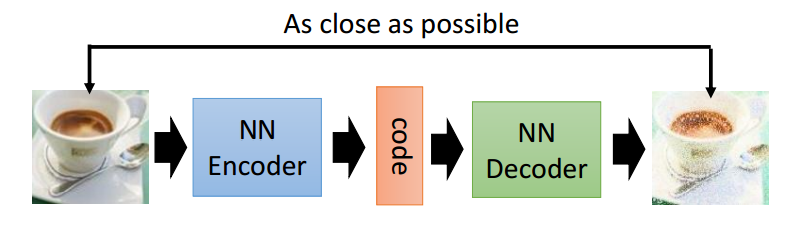
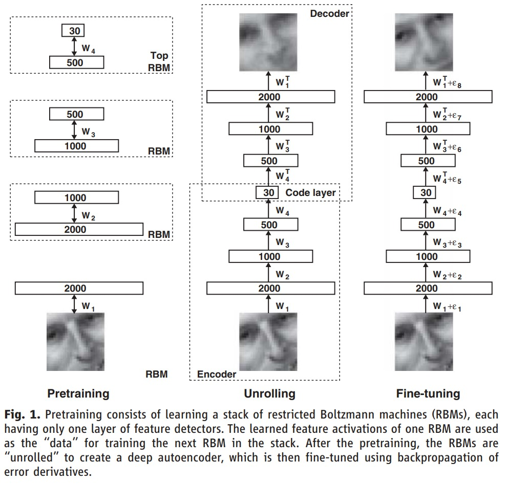
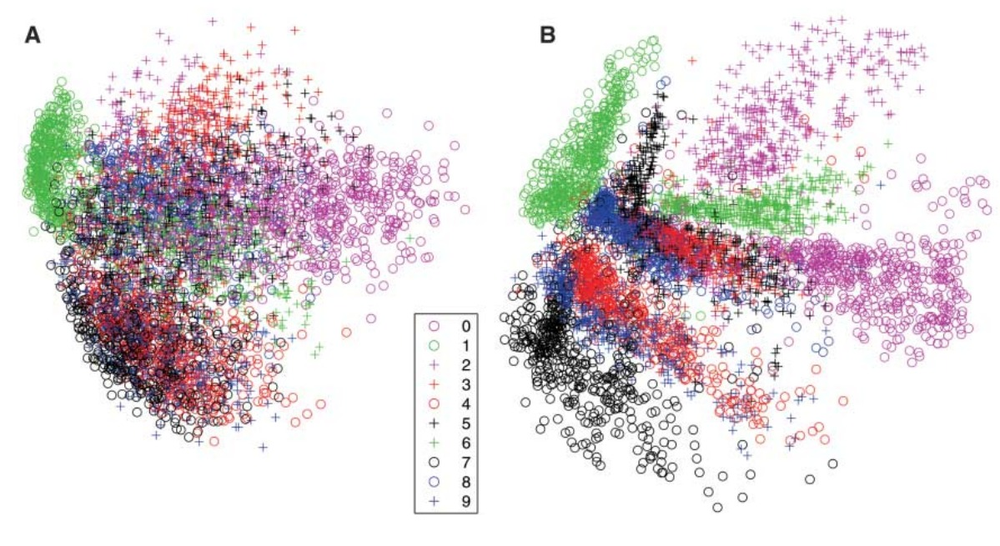
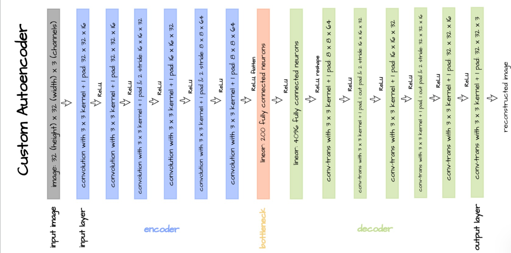

# AutoEncoder

## AutoEncoder by G. E. Hinton and R. R. Salakhutdinov

# Motivation

High-dimensional data can be converted to low-dimensional codes by training a multilayer neural network with a small central layer to reconstruct high-dimensional input vectors. 

`Gradient descent` can be used for fine-tuning the weights in such  ‘‘autoencoder’’ networks, but this works well only if the initial weights are close to a good solution. 

- Dimensionality reduction facilitates the classification, visualization, communication, and storage of high-dimensional data.

# Weights Initialization Problem

It is difficult to optimize the weights in nonlinear autoencoders that have multiple hidden layers (2–4). `With large initial weights`, autoencoders typically `find poor local minima`; `with small initial weights`, the `gradients in the early layers are tiny`, making it infeasible to train autoencoders with many hidden layers. If the initial weights are close to a good solution, gradient descent works well, but finding such initial weights requires a very different type of algorithm that learns one layer of features at a time.

# AutoEncoder vs PCA

- PCA is a linear method, while autoencoders are nonlinear.
- PCA is a supervised method, while autoencoders are unsupervised.
- PCA is a deterministic method, while autoencoders are stochastic.
- PCA is a method for dimensionality reduction, while autoencoders are methods for feature learning.

- (A) PCA and (B) Autoencoder.

# Implementation

## Convolutional AutoEncoder

---

Here we have implemented two types of AutoEncoder:

- Dense AutoEncoder
- Convolutional AutoEncoder

## Dense AutoEncoder

In this AutoEncoder, we have used `Dense` layers for encoding and decoding. 

## Convolutional AutoEncoder

In this AutoEncoder, we have used `Conv2D` layers for encoding and `Conv2DTranspose` layers for decoding.

- Here we have used a set of `2-Conv2D` layers followed by a `MaxPooling2D` layer for encoding. and In the decoding part, we have used a `Conv2DTranspose` then `UpSampling2D` layer and then again a `Conv2DTranspose` layer to follow the encoding part.
---