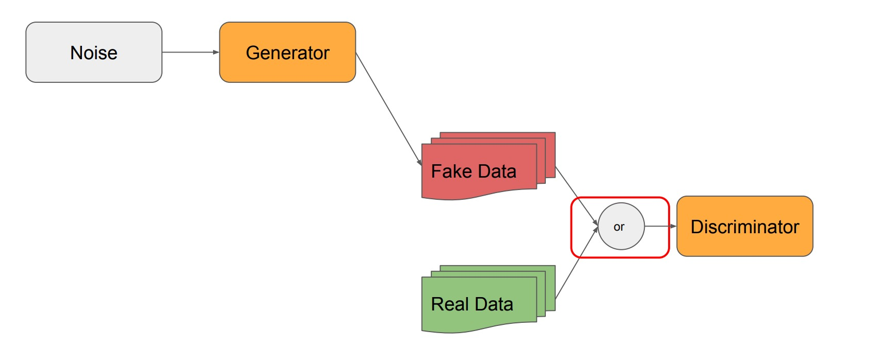
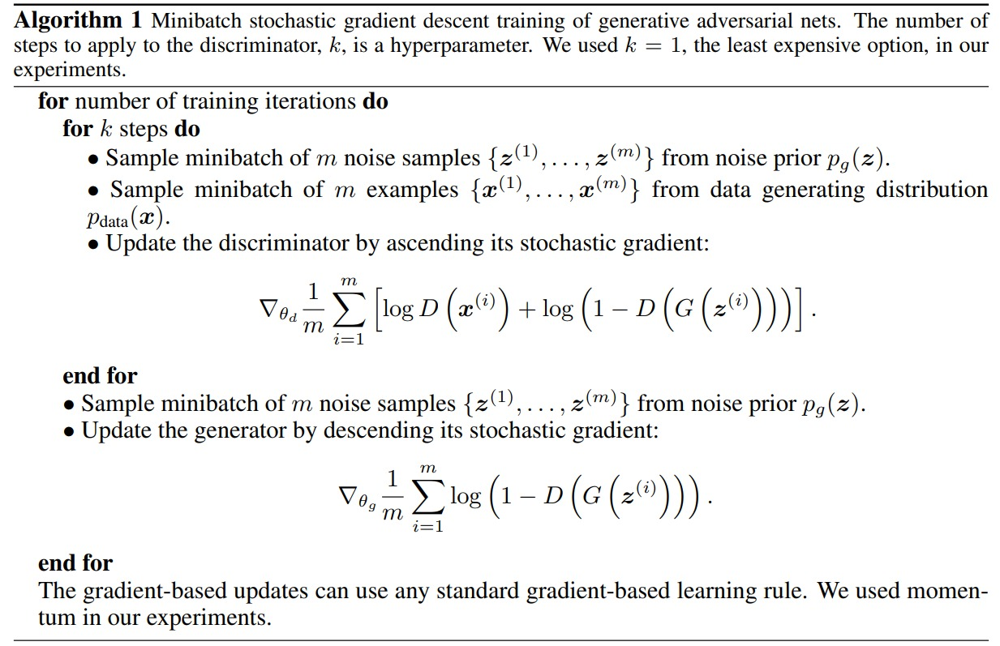

# Generative Adversarial Networks

## Generative Adversarial Networks by Ian Goodfellow, Jean Pouget-Abadie, Mehdi Mirza, Bing Xu, David Warde-Farley, Sherjil Ozair, Aaron Courville, and Yoshua Bengio

# Motivation

In this authors simultaniously trained two models, a generative model G that captures the data distribution, and a discriminative model D that estimates the probability that a sample came from the training data rather than G. The training procedure for G is to maximize the probability of D making a mistake. This framework corresponds to a minimax two-player game. In the space of arbitrary functions G and D, a unique solution exists, with G recovering the training data distribution and D equal to 1/2 everywhere. In the case where G and D are defined by multilayer perceptrons, the entire system can be trained with backpropagation. There is no need for any Markov chains or unrolled approximate inference networks during either training or generation of samples. Experiments demonstrate the potential of the framework through qualitative and quantitative evaluation of the generated samples.

# Algorithm-1

# Implementation

- **Preprocessing**
  - Normalize the images to [-1, 1] range to match the output of the tanh activation function of the generator.
  - Data must be in the form of batches of images.

## DenseGAN

- neurons: list of the number of neurons in each layer of the generator. First layer will have the `latent_dim` number of neurons. last layer will have the `output_shape` number of neurons.

## ConvGAN

- filters: list of the number of filters in each layer of the generator. First layer will have the `latent_dim` number of filters. last layer will have the `output_shape[-1]` (depth of image) number of filters.

- At last of the generator, image will be resized to output_shape.

- As filters increase the spatial dimension of the image will increase from 1x1 ->  4x4 to 8x8, 16x16, 32x32, 64x64, 128x128, 256x256, 512x512, 1024x1024. So don't give the filters beyond specific range so that output of the generator will be in the range of `output_shape` and it will be convient to resize the image to `output_shape`.