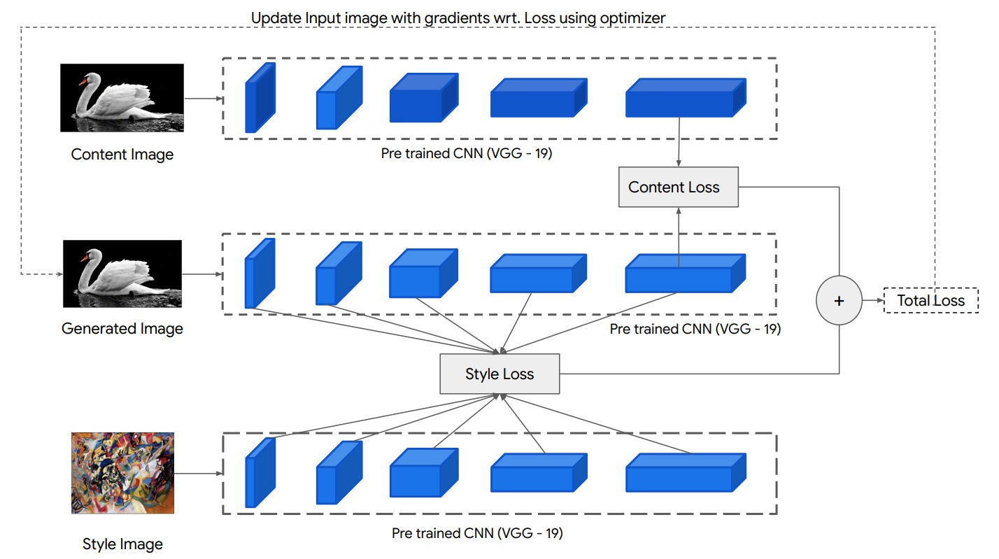
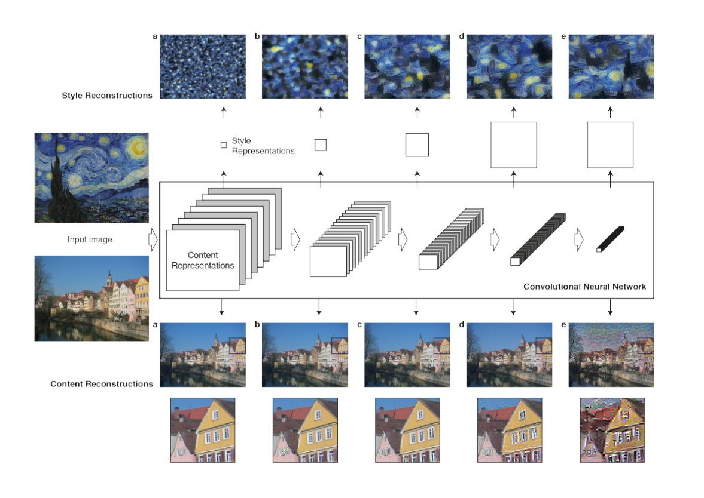

# Neural Style Transfer

## A Neural Algorithm of Artistic Style by Leon A. Gatys, Alexander S. Ecker, Matthias Bethge



# Motivation

In fine art, especially painting, humans have mastered the skill to create unique visual experiences through composing a complex interplay between the conetent and style of an image.

Here author introduced an artificial system based on a Deep Neural Network that creates artistic images of high perceptual quality. The system uses neural representations to separate and recombine content and style of arbitrary images, providing a neural algorithm for the creation of artistic images.

## Convolutional Neural Networks

Convolutional Neural Networks consist of layers of small computational units that process visual information hierarchically in a feed-forward manner. When CNN are trained, they develop a of the image that makes object information increasingly explicit along the processing hierarchy. Therefore, along the processing hierarchy of the network, the input image is transformed into representations that increasingly care about the actual content of the image compared to its detailed pixel values.

- Higher layers of the network capture the `high-level content` of the image, therefore author refers to the feature responses in higher layers as the `content representation` of the image.



- A given input image is represented as a set of filtered images at each processing stage in the CNN. While the number of different filters increases along the processing hierarchy, the size of the filtered images is reduced by some downsampling mechanism (e.g. max-pooling) leading to a decrease in the total number of units per layer of the network.

## Content Reconstructions

Authors reconstructed the input image from from layers ‘conv1 1’ (a), ‘conv2 1’ (b), ‘conv3 1’ (c), ‘conv4 1’ (d) and ‘conv5 1’ (e) of the original VGG-Network. and found that reconstruction from lower layers is almost perfect (a,b c). In higher layers of the network, detailed pixel information is lost while the high-level content of the image is preserved (d,e).

- **Content Loss**

$$L_{content} = \frac{1}{2} \sum_{i,j}(F_{ij}^{l} - P_{ij}^{l})^2$$

here $F_{ij}^{l}$ is the feature map of the input image at layer $l$ and $P_{ij}^{l}$ is the feature map of the content image at layer $l$.

- **Derivative of Content Loss**

$$\frac{\partial L_{content}}{\partial F_{ij}^{l}} = F_{ij}^{l} - P_{ij}^{l}$$

## Style Reconstructions

The style representation computes correlations between the different features in different layers of the CNN. Authors reconstructed the style of the input image from style representations built on different subsets of CNN layers ( ‘conv1 1’ (a), ‘conv1 1’ and ‘conv2 1’ (b), ‘conv1 1’, ‘conv2 1’ and ‘conv3 1’ (c), ‘conv1 1’, ‘conv2 1’, ‘conv3 1’ and ‘conv4 1’ (d), ‘conv1 1’, ‘conv2 1’, ‘conv3 1’, ‘conv4 1’ and ‘conv5 1’ (e)). This creates images that match the style of a given image on an increasing scale while discarding information of the global arrangement of the scene.

- **Style Loss**

$$L_{style} = \sum_{i,j} \left( \frac{G_{ij}^{l} - A_{ij}^{l}}{2N_{l}^2 M_{l}^2} \right)^2$$

here $G_{ij}^{l}$ is the Gram matrix of the input image at layer $l$ and $A_{ij}^{l}$ is the Gram matrix of the style image at layer $l$.

### Gram Matrix

$$G_{ij}^{l} = \sum_{k} F_{ik}^{l} F_{jk}^{l}$$

where $F_{ik}^{l}$ is the feature map of the input image at layer $l$ and $F_{jk}^{l}$ is the feature map of the style image at layer $l$.

- **Derivative of Style Loss**

$$\frac{\partial L_{style}}{\partial G_{ij}^{l}} = \frac{(F^l)^T(G_{ij}^{l} - A_{ij}^{l})}{N_{l}^2 M_{l}^2}$$

- As outlined above, the style representation is a multi-scale representation that includes multiple layers of the neural network. Style can also be defined more locally by including only a smaller number of lower layers, leading to different visual experiences.  
- When matching the style representations up to higher layers in the network, local images structures are matched on an increasingly large scale, leading to a smoother and more continuous visual experience.

# Implementation

## Authors used the VGG-19 network for style transfer.

Authors used the feature space provided by the 16 convolutional and 5 pooling layers of the 19 layer VGG Network. We do not use any of the fully connected layers.

- For image synthesis we found that replacing the max-pooling operation by average pooling improves the gradient flow and one obtains slightly more appealing results, which is why the images shown were generated with average pooling.

- **Total Loss**

$$L_{total} = \alpha L_{content} + \beta L_{style}$$

where $\alpha$ and $\beta$ are the weights of the content and style loss.

- I have implemented the Neural Style Transfer in which we can directly give the `content_image` path and `style_image` path directly while making and instance of the class `NeuralStyleTransfer`.

- you can also give the pretrained model's instance for extracting the features. plus no. of conv layers for style loss and content extraction.

- While training the model, you can also give the `content_weight` and `style_weight` to control the content and style loss.

- I have used the Variational Loss to make the image more realistic.

- while fitting the model, it will return the list of all the images generated during the training. which can be used to make a video/gif.

```python

style_transfer = NeuralStyleTransfer(
    style_image=style_image,
    content_image=content_image,
    extractor="inception_v3",
    n_style_layers=5,
    n_content_layers=5,
)

all_images = style_transfer.fit_style_transfer(
    epochs=10,
    learning_rate=80.0,
    steps_per_epoch=100,
    style_weight=1e-2,
    content_weight=1e4,
    show_image=True,
    show_interval=90,
    var_weight=2,
)

```