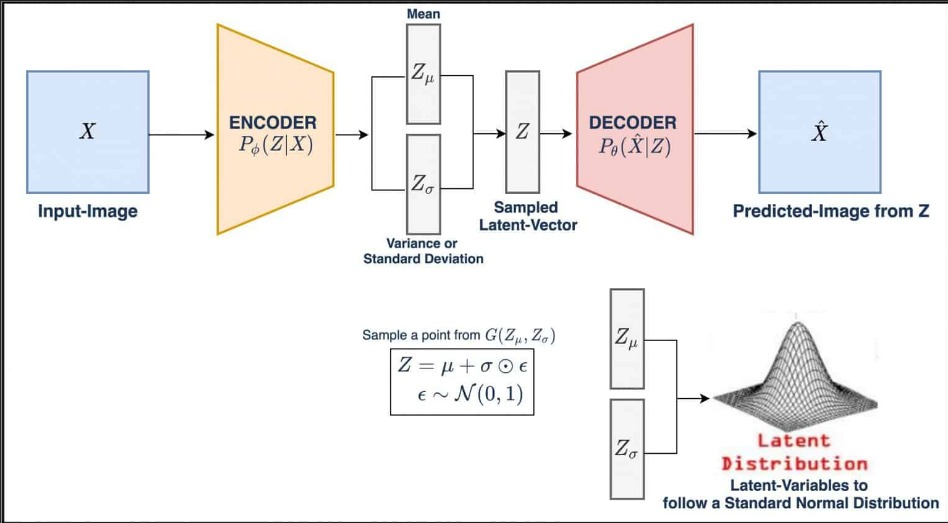
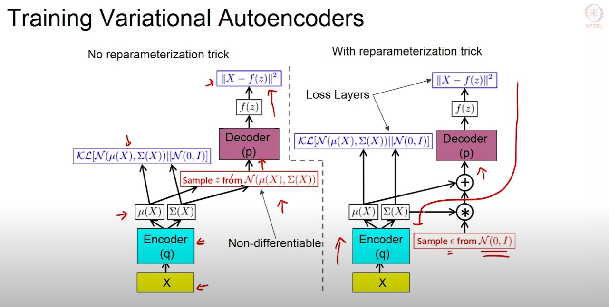

# Variation Auto-Encoder

## Auto-Encoding Variational Bayes by Diego I. Kingma and Max Welling

# Motivation

## Limitations of autoencoders for content generation

`what is the link between autoencoders and content generation?`

Indeed, once the autoencoder has been trained, we have both an encoder and a decoder but still no real way to produce any new content. At first sight, we could be tempted to think that, if the latent space is regular enough (well “organized” by the encoder during the training process), we could take a point randomly from that latent space and decode it to get a new content. The decoder would then act more or less like the generator of a `Generative Adversarial Network`.

However, the regularity of the latent space for autoencoders is a difficult point that depends on the distribution of the data in the initial space, the dimension of the latent space and the architecture of the encoder. So, it is pretty difficult (if not impossible) to ensure, a priori, that the encoder will organize the latent space in a smart way compatible with the generative process we just described.

- The `autoencoder is solely trained to encode and decode with as few loss as possible, no matter how the latent space is organised`. Thus, if we are not careful about the definition of the architecture, it is natural that, during the training, the network takes advantage of any overfitting possibilities to achieve its task as well as it can… unless we explicitly regularise it!

# Variational Auto-Encoder

A variational autoencoder can be defined as being an autoencoder whose training is regularised to avoid overfitting and ensure that the latent space has good properties that enable generative process.

Just as a standard autoencoder, a variational autoencoder is an architecture composed of both an encoder and a decoder and that is trained to minimise the reconstruction error between the encoded-decoded data and the initial data. However, in order to introduce some regularisation of the latent space, we proceed to a slight modification of the encoding-decoding process: instead of encoding an input as a single point, we encode it as a distribution over the latent space. The model is then trained as follows:

1. the input is encoded as distribution over the latent space
2. a point from the latent space is sampled from that distribution
3. the sampled point is decoded and the reconstruction error can be computed
4. the reconstruction error is backpropagated through the network.

- The reason why an input is encoded as a distribution with some variance instead of a single point is that it makes possible to express very naturally the latent space regularisation: the distributions returned by the encoder are enforced to be close to a standard normal distribution.

# Loss Function

The loss function of a variational autoencoder is composed of two terms:

$$  \mathcal{L} = \mathbb{E}_{q_{\phi}(z|x)}\left[\log p_{\theta}(x|z)\right] - KL(q_{\phi}(z|x)||p(z)) $$

- the `reconstruction error` between the input and the decoded output

- the `KL divergence` between the distribution returned by the encoder and the standard normal distribution.

- Here we use `Reparameterization Trick` to sample from the distribution. The reparameterization trick is a trick to backpropagate through a random node in a computational graph. The trick is to replace the random variable with a new random variable that is a function of the original random variable. This new random variable is no longer random, but it is a deterministic function of the original random variable. This new random variable can be used in the computation graph, and the gradient can be backpropagated through it.

