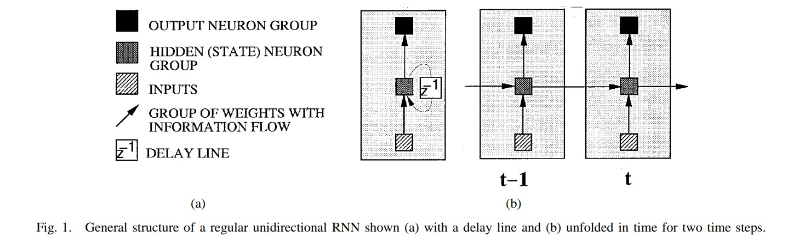
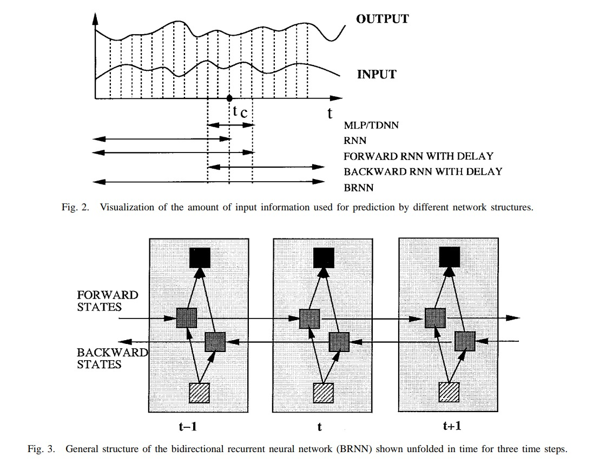

# BRNN

## Bidirectional Recurrent Neural Networks by Schuster and Paliwal

# Introduction

Bidirectional RNNs are based on the idea that the output at time t may not only depend on the previous elements in the sequence, but also future elements. 

---
`Future input information` coming up later than $t_c$ is usually
also useful for prediction. With an RNN, this can be `partially
achieved` by `delaying the output` by a certain number` of $M$ time frames to include future information up to $X_{{t_c}+M}$ to predict $y_{t_c}$. 

- Theoretically, $M$ could be made very large to include all future information, but in practice, it is found that `prdeiction results drop if` $M$ `is too large`. A possible explanation for this could be that with rising $M$ , the modeling power of the RNN is increasingly concentrated on remembering the input information up to $X_{{t_c}+M} for the prediction of $y_{t_c}$, leaving less modeling power for combining the prediction knowledge from different input vectors.

---

## Bidirectional RNNs

To use `all available input information`, it is possible to use
`two separate networks` (one for each time direction) and then
somehow merge the results. Both networks can then be called
experts for the specific problem on which the networks are
trained.

- For `merging the results`, authors used `averaging for regression and geometric averaging for classification`. It is
generally not clear how to merge network outputs in an optimal
way since different networks trained on the same data can no
longer be regarded as independent.

With both time directions taken care of in the same network, input information in the past and the future of the currently evaluated time frame can directly be used to minimize the objective function without the need for delays to include future information, as for the regular unidirectional RNN discussed above.