# Sequence Models

Sequence models are used to process **sequence data**. Unlike standard feedforward neural networks, sequence models are able to **remember** the **past** and **predict** the **future**. Examples of sequence data include **sentences**, **music**, **video clip** and **weather data**.

Examples of Sequence Models include:

- **Recurrent Neural Networks (RNNs)**: 
- **Bidirectional RNN**:
- **Long Short-Term Memory (LSTM)**:
- **Gated Recurrent Unit (GRU)**:

Sequence models can be used for:

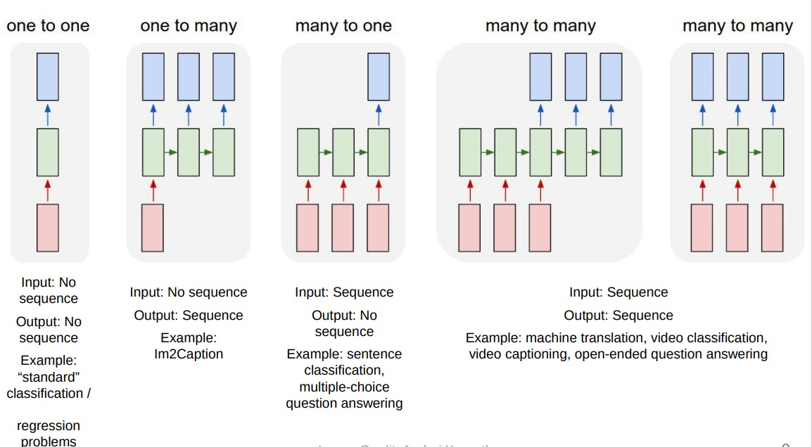

# Why Sequence Models?

Traditional models such as **linear regression** and **logistic regression** are not suitable for sequence data because they assume that the input and output are **independent** of each other. However, in sequence data, the **current** output is **dependent** on the **previous** inputs. Another limitation of traditional models is that they assume that the input and output are of **fixed size**. However, in sequence data, the **input** and **output** can be of **variable size**. Furthermore, traditional models do not share features learned across different positions of text. For example, in a sentence, the features learned for the word "cat" can be used for the word "dog". However, traditional models do not share features learned across different positions of text.

# RNN

RNN addresses the issue of **memory**. They are networks with loops in them, allowing information to persist. In RNN, output at time t depend not only on the input at time t but also on the outputs from previous times.

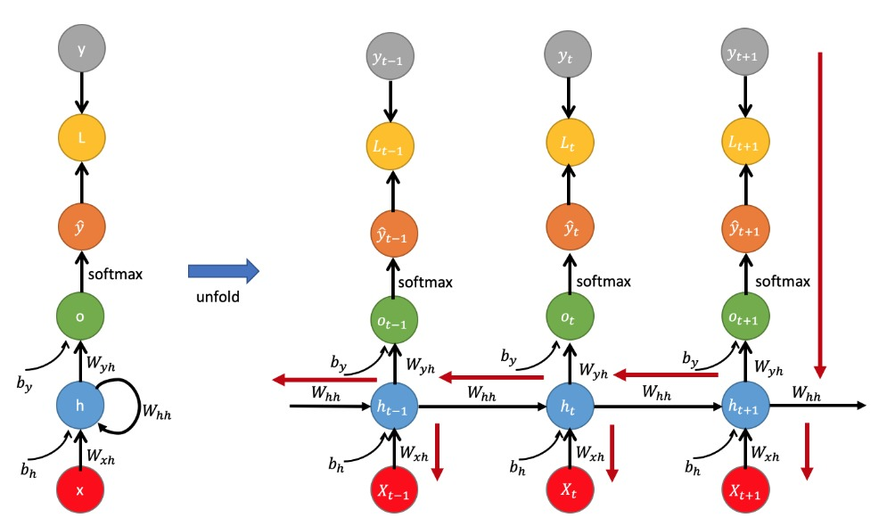

## Key Ideas of RNN

- **Parameter Sharing**: A feature learned at time step t can be used at time step t+1. For example, the features learned for the word "cat" can be used for the word "dog".

- **Unrolled Network**: RNN can be unrolled into a full network. The unrolled network shows the same network with the same parameters being applied at each time step.

## Forward Propagation

There are two equations for forward propagation in RNN:

$$ a^{<t>} = g_1(W_{aa}a^{<t-1>} + W_{ax}x^{<t>} + b_a) $$
$$ \hat{y}^{<t>} = g_2(W_{ya}a^{<t>} + b_y) $$

where:

- $y^{<t>}$: output at time step t
- $\hat{y}^{<t>}$: predicted output at time step t
- $W_{aa}$: weight matrix for hidden state
- $W_{ax}$: weight matrix for input
- $W_{ya}$: weight matrix for output
- $g_1$: activation function for hidden state, usually `tanh`
- $g_2$: activation function for output, usually `softmax`

**Note**: 

- $W_{aa}$, $W_{ax}$, $W_{ya}$, $b_a$ and $b_y$ are shared across all time steps.
- $a^{<0>}$ is usually initialized to zero.

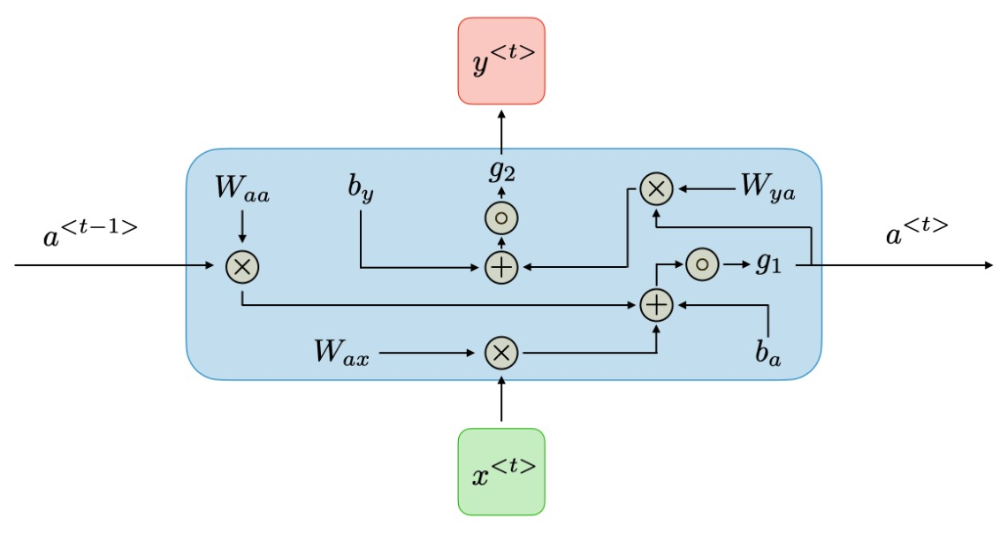

## Backward Propagation (Backpropagation Through Time BPTT)

The goal of backpropagation is to calculate the gradients of the loss function with respect to the parameters of the model. The gradients are then used to update the parameters of the model.

In the case of RNN, the loss function $\mathcal{L}$ of all time steps is defined based on the loss at every time step as follows:

$$ \mathcal{L} = \sum_{t=1}^{T_y} \mathcal{L}^{<t>} $$

where $\mathcal{L}^{<t>}$ is the loss at time step t, which is defined as follows:

$$ \mathcal{L}^{<t>} = -y^{<t>} \log \hat{y}^{<t>} $$

Backpropagation is done at each point in time. At timestep $T$, the derivative of the loss $\mathcal{L}$ with respect to weight matrix $W$ is expressed as follows:

$$ \frac{\partial \mathcal{L}}{\partial W} = \sum_{t=1}^{T} \frac{\partial \mathcal{L}^{<t>}}{\partial W} $$

where $\frac{\partial \mathcal{L}^{<t>}}{\partial W}$ is the derivative of the loss $\mathcal{L}^{<t>}$ at time step $t$ with respect to weight matrix $W$.

### Derivative of Loss with Respect to Weight Matrix $W_{ya}$

$$ \frac{\partial \mathcal{L}}{\partial W_{ya}} = \sum_{t}^{T} \frac{\partial \mathcal{L}^{<t>}}{\partial \hat{y}^{<t>}} \frac{\partial \hat{y}^{<t>}}{\partial W_{ya}} $$

similarly for $b_y$:

$$ \frac{\partial \mathcal{L}}{\partial b_y} = \sum_{t}^{T} \frac{\partial \mathcal{L}^{<t>}}{\partial \hat{y}^{<t>}} \frac{\partial \hat{y}^{<t>}}{\partial b_y} $$

### Derivative of Loss with Respect to Weight Matrix $W_{aa}$

Let's use $\mathcal{L}_{t+1}$ to denote the output at time step $t+1$, $\mathcal{L}_{t+1} =-y_{t+1} \log \hat{y}_{t+1}$

$$ \frac{\partial \mathcal{L}_{t+1}}{\partial W_{aa}} = \frac{\partial \mathcal{L}_{t+1}}{\partial y_{t+1}} \frac{\partial y_{t+1}}{\partial a_{t+1}} \frac{\partial a_{t+1}}{\partial W_{aa}} $$

here we considered only one time-step (t->t+1). But, the hidden state $a_{t+1}$ depends on the previous hidden state $a_t$.

Thus at the time stem $t-1 \rightarrow t$, we have:

$$ \frac{\partial \mathcal{L}_{t+1}}{\partial W_{aa}} = \frac{\partial \mathcal{L}_{t+1}}{\partial y_{t+1}} \frac{\partial y_{t+1}}{\partial a_{t+1}} \frac{\partial a_{t+1}}{\partial a_{t}} \frac{\partial a_{t}}{\partial W_{aa}} $$

Thus at the time step $t+1$, we can compute the gradient  and further use backpropagation through time from $t+1$ to 1 to compute the overall gradient with respect to $W_{aa}$.

$$ \frac{\partial \mathcal{L}_{t+1}}{\partial W_{aa}} = \sum_{k=0}^{t} \frac{\partial \mathcal{L}_{t+1}}{\partial y_{t+1}} \frac{\partial y_{t+1}}{\partial a_{t+1}} \frac{\partial a_{t+1}}{\partial a_{k}} \frac{\partial a_{k}}{\partial W_{aa}} $$

Note that $\frac{\partial a_{t+1}}{\partial a_{k}}$ is a chain rule in itself. 

Hence we can write:

$$ \frac{\partial a_{t+1}}{\partial a_{k}} = \prod_{i=k+1}^{t+1} \frac{\partial a_{i}}{\partial a_{i-1}} $$

Therefore finally we have:

$$ \frac{\partial \mathcal{L}_{t+1}}{\partial W_{aa}} = \sum_{k=1}^{t+1} \frac{\partial \mathcal{L}_{t+1}}{\partial y_{t+1}} \frac{\partial y_{t+1}}{\partial a_{t+1}} \prod_{i=k+1}^{t+1} \frac{\partial a_{i}}{\partial a_{i-1}} \frac{\partial a_{k}}{\partial W_{aa}} $$

### Derivative of Loss with Respect to Weight Matrix $W_{ax}$

$$ \frac{\partial \mathcal{L}_{t+1}}{\partial W_{ax}} = \sum_{k=1}^{t+1} \frac{\partial \mathcal{L}_{t+1}}{\partial y_{t+1}} \frac{\partial y_{t+1}}{\partial a_{t+1}} \prod_{i=k+1}^{t+1} \frac{\partial a_{i}}{\partial a_{i-1}} \frac{\partial a_{k}}{\partial W_{ax}} $$

## Problems with RNN

[Paper](https://arxiv.org/pdf/1211.5063.pdf) On the difficulty of training Recurrent Neural Networks.

### Exploding Gradients

The gradients can explode if the dominant eigenvalue of the matrix $W_{aa}$ is greater than 1. In this case, the gradients will explode exponentially as we backpropagate through time. It can be solved by gradient clipping.

### Vanishing Gradients

The gradients can vanish if the dominant eigenvalue of the matrix $W_{aa}$ is less than 1. In this case, the gradients will vanish exponentially as we backpropagate through time. It can be solved by using a better architecture such as LSTM or GRU.

- Because of these problems, RNNs are not used for long sequences.

# Bidirectional RNN

There are many other sequence learning tasks contexts where it’s perfectly fine to condition the prediction at every time step on both the leftward and the rightward context. Consider, for example, part of speech detection. For example, consider the three sentences:

1. I am ____.
2. I am ____ hungry.
3. I am ____ hungry and I can’t wait for dinner.

In the first sentence, the blank is most likely a verb. In the second sentence, the blank is most likely an adjective. In the third sentence, the blank is most likely an adverb. So, the prediction at the blank depends on both the leftward and the rightward context.

Due to this reason, we need to use bidirectional RNNs. In bidirectional RNNs, we have two hidden layers, one for the forward pass and one for the backward pass. The output at each time step is the concatenation of the output of the forward pass and the backward pass and then feed this to softmax to get the prediction.

Mathematically, we can write:

$$ a^{<t>}_{forward} = g(W_{aa}^{forward} a^{<t-1>}_{forward} + W_{ax}^{forward} x^{<t>} + b_{a}^{forward}) $$
$$ a^{<t>}_{backward} = g(W_{aa}^{backward} a^{<t+1>}_{backward} + W_{ax}^{backward} x^{<t>} + b_{a}^{backward}) $$
$$ \hat{y}^{<t>} = softmax(W_{ya} [a^{<t>}_{forward}, a^{<t>}_{backward}] + b_y) $$

# GRU

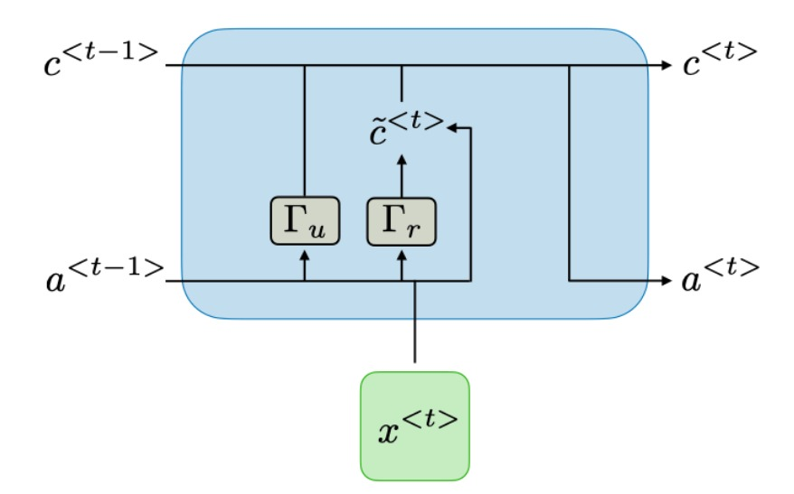

GRU stands for Gated Recurrent Unit. Each layer of GRU has a new variable called $c$ which is called the memory cell. It can tell to the network whether to remember something or not. In GRU $c^{<t>} = a^{<t>}$. Here we have two gates and one cell state. The cell state is kind of like a conveyor belt. It runs straight down the entire chain, with only some minor linear interactions. It’s very easy for information to just flow along it unchanged. Also, $c^{<t>} = a^{<t>}$, we no longer have to worry about the vanishing gradient problem.

## Update Gate

The update gate decides what parts of the past to keep and what parts of the past to forget. The update gate is computed as:

$$ \Gamma_u = \sigma(W_u [c^{<t-1>}, x^{<t>}] + b_u) $$

## Reset Gate

The reset gate decides what parts of the past to throw away. The reset gate is computed as:

$$ \Gamma_r = \sigma(W_r [c^{<t-1>}, x^{<t>}] + b_r) $$

## Cell State

The cell state is computed as:

$$ c^{<t>} = \Gamma_u * c^{<t-1>} + (1 - \Gamma_u) * \tilde{c}^{<t>} $$

where $\tilde{c}^{<t>} = tanh(W_c [\Gamma_r * c^{<t-1>}, x^{<t>}] + b_c)$ which is the new candidate value for the cell state.

# LSTM

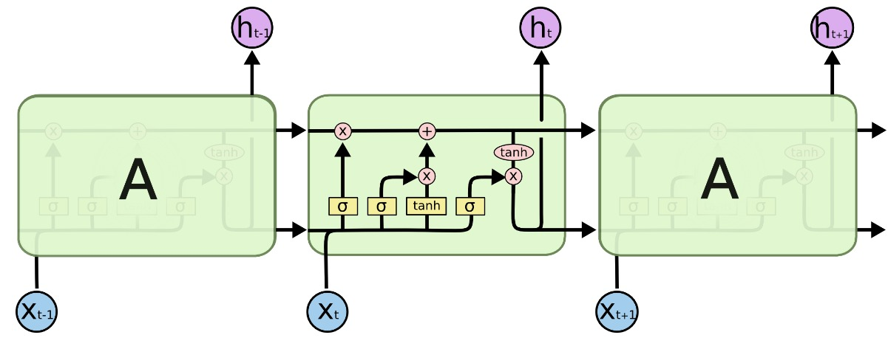

LSTM stands for Long Short Term Memory.  LSTMs are explicitly designed to avoid the long-term dependency problem. Remembering information for long periods of time is practically their default behavior, not something they struggle to learn!

## Cell State

The key to LSTMs is the cell state, the horizontal line running through the top of the diagram.

The cell state is kind of like a conveyor belt. It runs straight down the entire chain, with only some minor linear interactions. It’s very easy for information to just flow along it unchanged.

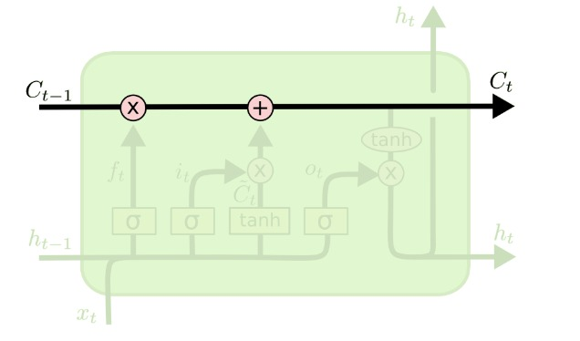

The LSTM does have the ability to remove or add information to the cell state, carefully regulated by structures called gates.

Gates are a way to optionally let information through. They are composed out of a sigmoid neural net layer and a pointwise multiplication operation. The sigmoid layer outputs numbers between zero and one, describing how much of each component should be let through. A value of zero means “let nothing through,” while a value of one means “let everything through!” An LSTM has three of these gates, to protect and control the cell state.

## Forget Gate

The forget gate decides what information we’re going to throw away from the cell state. The forget gate is computed as:

| | |
|-|-|
|| $$ \Gamma_f = \sigma(W_f [h^{<t-1>}, x^{<t>}] + b_f) $$ |

$ \Gamma_f = 1 $ means remember everything

$ \Gamma_f = 0 $ means forgot everything 

## Input Gate

The input gate decides what new information we’re going to store in the cell state. It has two parts. First, a sigmoid layer called the “input gate layer” decides which values we’ll update. Next, a tanh layer creates a vector of new candidate values, $\tilde{c}^{<t>}$, that could be added to the state. In the next step, we’ll combine these two to create an update to the state.

| | |
|-|-|
|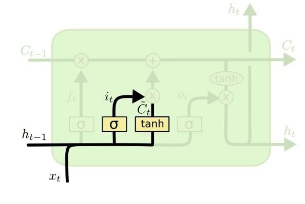| $$ \Gamma_i = \sigma(W_i [h^{<t-1>}, x^{<t>}] + b_i) $$ .$$ \tilde{c}^{<t>} = tanh(W_c [h^{<t-1>}, x^{<t>}] + b_c) $$ |

## Output Gate

This cell is responsible for updating the old cell state, $c^{<t-1>}$, into the new cell state $c^{<t>}$. We multiply the old state by $ \Gamma_f $, forgetting the things we decided to forget earlier. Then we add $ \Gamma_i * \tilde{c}^{<t>} $. This is the new candidate values, scaled by how much we decided to update each state value.

| | |
|-|-|
|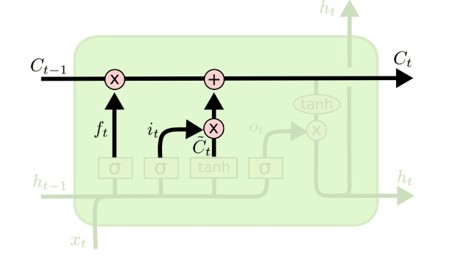| $$ c^{<t>} = \Gamma_f * c^{<t-1>} + \Gamma_i * \tilde{c}^{<t>} $$ |

Finally, we need to decide what we’re going to output. This output will be based on our cell state, but will be a filtered version. First, we run a sigmoid layer which decides what parts of the cell state we’re going to output. Then, we put the cell state through tanh (to push the values to be between −1 and 1) and multiply it by the output of the sigmoid gate, so that we only output the parts we decided to.

For the language model example, since it just saw a subject, it might want to output information relevant to a verb, in case that’s what is coming next. For example, it might output whether the subject is singular or plural, so that we know what form a verb should be conjugated into if that’s what follows next.

| | |
|-|-|
|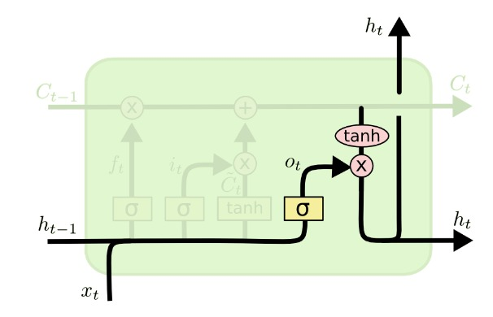| $$ \Gamma_o = \sigma(W_o [h^{<t-1>}, x^{<t>}] + b_o) $$ . $$ h^{<t>} = \Gamma_o * tanh(c^{<t>}) $$ |

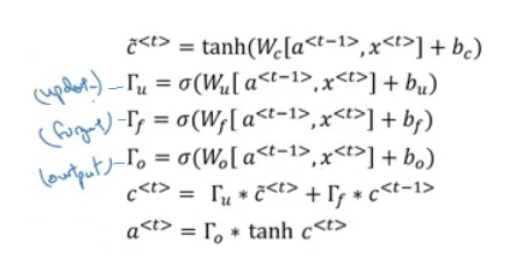

**Note**: We studied GRU earlier. GRU is nothing but a special type of LSTM. It combines the forget and input gates into a single “update gate.” It also merges the cell state and hidden state, and makes some other changes.

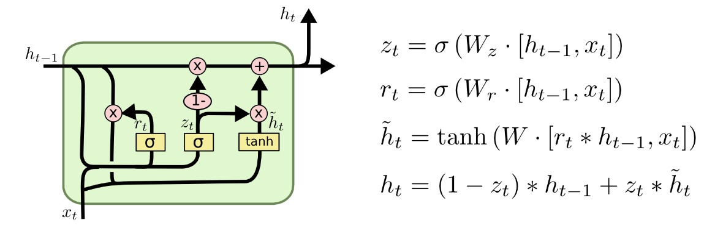