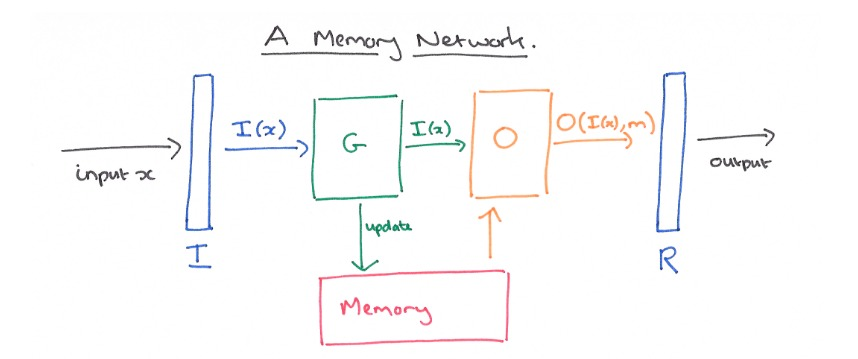

# Memory Networks

## Memory Networks by Jason Weston, Sumit Chopra, Antoine Bordes (2015)

# Motivation

It is important to store a large amount of prior knowledge for reasoning. Traditional deep learning models such as RNN, LSTM, and GRU use hidden states or Attention mechanisms as their memory, these models are powerful sequence predictors that can be efficiently trained to learn to do inference, but the memory used by these models are limited. The state and weights are all embedded in a low-dimensional space, and the knowledge is compressed into a dense vector. These models can perform poorly on tasks that involve long-term dependencies. A large number of experiments and Researchers have proved that LSTM is not effective enough for a longer time, and cannot achieve the effect of recording more and longer memory.

- The `goal` of this paper is to `build a model` that can `reason` over `long-term dependencies` in `textual` and `visual` question answering tasks. As RNN's memory is typically too small and is not designed to accurately remember information for long periods of time, the authors propose a new architecture called `Memory Networks` that can `access an external memory component` to `store information` and `reason` over it.

# Introduction

Memory Networks consists of a `memory component` and four modules: `input feature map`, `generalization`, `output feature map`, and `response`. 

## The memory component

It is a set of key-value pairs, where the key is a representation of the input and the value is the output. 

## The input feature map (I)

It is a function that maps the input to a internal feature representation. It can make use of standard preprocessing techniques such as word embeddings, bag-of-words, etc.

## The generalization module (G)

It updates old memories given the new input. We call this generalization as there is an opportunity for the network to compress and generalize its memories at this stage for some intended future use.

## The output feature map (O)

It produces a new output (in the feature representation space), given the new input and the current memory state. This component is typically responsible for reading from the memory and perform inference (calculating what are the relevant memories to perform a good response.).

## The response module (R)

It converts the output into the response format desired. For example, a textual response or an action. R could be an RNN conditioned on the output of O.

# Flow of the mdoel

- Given input $x$

- Convert $x$ to an internal feature representation $I(x)$.

- Update memories mi given the new input: $m_i = G(m_i
, I(x), m)$, ∀i.

- Compute output features $o$ given the new input and the memory: $o = O(I(x), m)$.

- Finally, decode output features o to give the final response: $r = R(o)$

The most basic version of their MemNN works as follows. I is given a sentence at a time, and G simply stores the sentence in the next available memory slot (i.e., we assume there are more memory slots than sentences). All of the hard work is done in the O and R components. O is used to find up to k supporting memories. The first memory is found by scoring the match between the input sentence and each sentence in memory, and returning the one with the highest score. For k > 1, the n_th memory (1 < n ≤ k) is found by comparing both the original input sentence and all of the n-1 supporting memories found so far against the sentences in memory. The sentence with the highest matching score is returned. The output of O is a list of sentences containing the original input sentence and the _k supporting sentences it has found . The simplest version of R can simply return the first supporting sentence, a more sophisticated version might use an RNN to perform sentence generation. A compromise is to limit textual responses to be a single word using a scoring function over all of the words in the dictionary and the sentences produced by O.

## If set of stored Memory is large enough then it would be prohibitively expensive to compare the input to all of the memories.

### Hashing words

To speed up the lookup, authors used the hashing trick. Hash the input $I(x)$ into one or more buckets and then only score memories $m_i$ that are in the same buckets. 

- Problem with this is that a memory $m_i$ will only be considered if it shares at least one word with the input $I(x)$.

### Content-based addressing

After training the embedding matrix UO, we run K-means to cluster word vectors $(UO)_i$, thus giving K buckets. We then hash a given sentence into all the buckets that its individual words fall into. As word vectors tend to be close to their synonyms, they cluster together and we thus also will score those similar memories as well

---
---

# References

- [Memory Networks for Q&A](https://www.analyticsvidhya.com/blog/2021/06/memory-networks-for-qaquestion-and-answer-applications/)
- [Memory Networks](https://blog.acolyer.org/2016/03/10/memory-networks/)