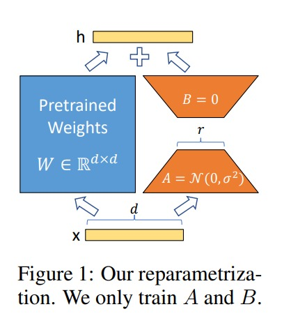

# LoRA: LOW-RANK ADAPTATION OF LARGE LANGUAGE MODEL 

## Introduction

In NLP, we need to fine-tune a large pretrained language model for downstream tasks. However, the number of parameters in the pretrained language model is huge, which makes it difficult to fine-tune on small datasets. 

## Adapter Layers Introduce Inference Latency

Many sought to mitigate this by adapting only some parameters or learning external modules for new tasks. This way, we only need to store and load a small number of task-specific parameters in addition to the pre-trained model for each task, greatly boosting the operational efficiency when deployed. 

large neural networks rely on hardware parallelism to keep the latency low, and adapter layers have to be processed sequentially. This makes a difference in the online inference setting where the batch size is typically as small as one. In a generic scenario without model parallelism, such as running inference on GPT-2 medium on a single GPU, we see a noticeable increase in latency when using adapters, even with a very small bottleneck dimension.

## Directly Optimizing the Prompt is Hard

The other direction, as exemplified by prefix tuning, faces a different challenge. We observe that prefix tuning is difficult to optimize and that its performance changes non-monotonically in trainable parameters. More fundamentally, reserving a part of the sequence length for adaptation necessarily reduces the sequence length available to process a downstream task, which we suspect makes tuning the prompt less performant compared to other methods.

# LoRA

In LoRA, we freeze the parameters of a large pretrained language model and injects trainable rank decomposition matrices into each layer of the Transformer architecture, greatly reducing the number of trainable parameters for downstream tasks.

- LoRA allows us to train some dense layers in a neural network indirectly by optimizing rank decomposition matrices of the dense layers’ change during adaptation instead, while keeping the pre-trained weights frozen.

- This simple linear design allow to merge the trainable matrices with the frozen weights when deployed, introducing no inference latency compared to a fully fine-tuned model, by construction.

## Matrix Multiplication

Neural Networks contains many dense layers which perform matrix multiplication. The weight matrices in these layers typically  have full-rank. When adapting to a specific task, these pre-trained language models have a low `instrisic dimension` and can still learn efficiently despite a random projection to a smaller subspace.

Earlier we have,

$$h = W_0x$$

but now we modify it as,

$$h = W_0x + \triangle Wx= W_0x + BAx$$

where $B$ and $A$ have trainable parameters.

if $W_0$ is a $d \times k$ matrix, $B$ is a $d \times r$ matrix and $A$ is a $r \times k$ matrix, then the number of trainable parameters is $d \times r + r \times k$. where $r$ << min($m$, $n$). $r$ is `intrinsic low-rank` of the matrix $W_0$.

- Scale the $\triangle W$ by factor $\frac{\alpha}{r}$. 

## APPLYING LORA TO TRANSFORMER

In Transformer architecture, there are four weight matrices in self-atteention module $(W_q, W_k, W_v, W_o)$ and two weight matrices in feed-forward module $(W_1, W_2)$.

- For downstream tasks, we don't need to adapt feed-forward module.

## Benifits and Limitations of LoRA

**Benifits**

- Less memory footprint as now we have to store only $d \times r + r \times k$ parameters instead of $d \times k$ parameters.

- We can switch between different tasks while deployed at a much lower cost by only swapping the LoRA weights as opposed to all the parameters.

- Speed up during LoRA fine-tuning compared to full fine-tuning as now we do not need to calculate the gradient for the vast majority of the parameters.

**Limitation**

- It is not straightforward to batch inputs to different tasks with different A and B in a single forward pass, if one chooses to absorb A and B into W to eliminate additional inference latency. Though it is possible to not merge the weights and  dynamically choose the LoRA modules to use for samples in a batch for scenarios where latency is not critical.