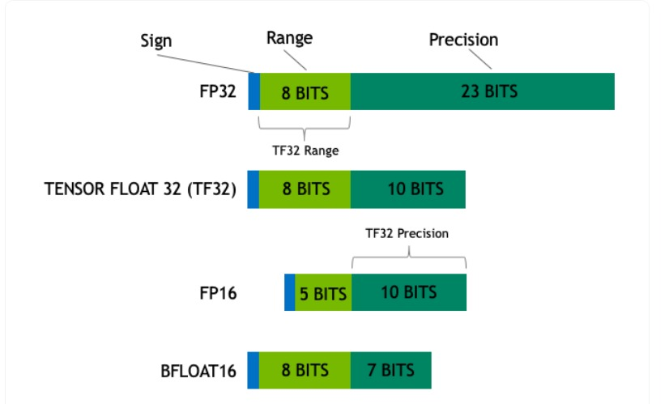
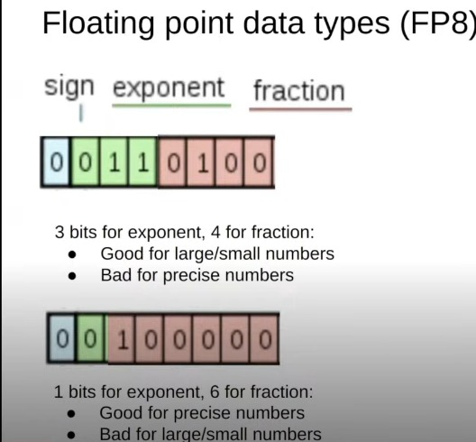
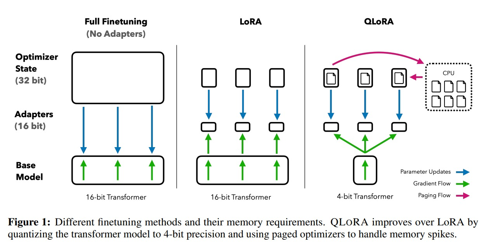

# QLoRA: Efficient Finetuning of Quantized LLMs

## Quantization 

It is the process of reducing the precision of a model's weights to reduce the memory footprint and improve `inference` speed.

[Block-wise Quantization](https://www.youtube.com/watch?v=EQkhGXSZA2s)

Quantization is the process of discretizing an input from a representation that holds more information to a representation with less information. It often means taking a data type with more bits and converting it to fewer bits, for example from float-32 to int-8 Integers.

- Suppose we want to quantize a 32-bit float to an 8-bit integer. 

$$ X^{int-8} = round(\frac{127}{max(X^{float-32})}* X^{float-32}) = round(c * X^{float-32}) $$

- **Dequantization** is the process of converting a quantized representation back to a higher precision representation.

$$ X^{float-32} = \frac{X^{int-8}}{c} $$

**Note**: If a large magnitude value (i.e., an outlier) occurs in the input tensor, then the quantization bins—certain bit combinations—are not utilized well with few or no numbers quantized in some bins. To prevent the outlier issue, a common approach is to chunk the input tensor into blocks that are independently quantized, each with their own quantization constant c.

**Common data types used** 

### 4-bit NormalFloat

Theoretically optimal quantization data type for normally distributed data that yields better empirical results than 4-bit Integers and 4-bit Floats.

- It stores values between [-1,1]

### Double Quantization

A method that quantizes the quantization constants (c), saving an average of about 0.37 bits per parameter.

- As the number of parameters in a model increases, the outliers also increase, hence DQ is needed.

### Paged Optimizers

Using NVIDIA unified memory to avoid the gradient checkpointing memory spikes that occur when processing a mini-batch with a long sequence length.

## QLoRA

QLORA has one low-precision storage data type, in our case usually 4-bit, and one computation data type that is usually BFloat16. In practice, this means whenever a QLORA weight tensor is used, we dequantize the tensor to BFloat16, and then perform a matrix multiplication in 16-bit.

